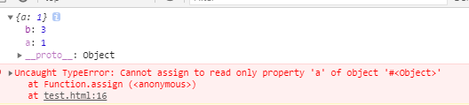
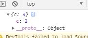
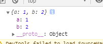
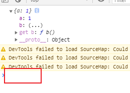
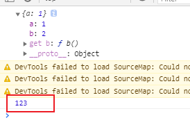
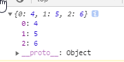
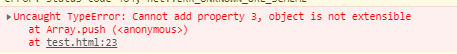
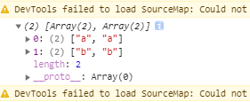
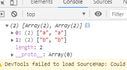

# Object

## Object.defineProperty

**通过对象字面量定义的对象的属性描述符默认是 true**

[MDN](https://developer.mozilla.org/en-US/docs/Web/JavaScript/Reference/Global_Objects/Object/defineProperty)

> The static method Object.defineProperty() defines a new property directly on an object, or modifies an existing property on an object, and returns the object.

> Property descriptors present in objects come in two main flavors: data descriptors and accessor descriptors. A data descriptor is a property that has a value, which may or may not be writable. An accessor descriptor is a property described by a getter-setter pair of functions. A descriptor must be one of these two flavors; it cannot be both.

> Both data and accessor descriptors are objects. They share the following optional keys (please note: the defaults mentioned here are in the case of defining properties using Object.defineProperty()):

> configurable
> true if the type of this property descriptor may be changed and if the property may be deleted from the corresponding object.
> Defaults to false.

> enumerable
> true if and only if this property shows up during enumeration of the properties on the corresponding object.
> Defaults to false.

> A data descriptor also has the following optional keys:

> value
> The value associated with the property. Can be any valid JavaScript value (number, object, function, etc).
> Defaults to undefined.

> writable
> true if the value associated with the property may be changed with an assignment operator.
> Defaults to false.

> An accessor descriptor also has the following optional keys:

> get
> A function which serves as a getter for the property, or undefined if there is no getter. When the property is accessed, this function is called without arguments and with this set to the object through which the property is accessed (this may not be the object on which the property is defined due to inheritance). The return value will be used as the value of the property.
> Defaults to undefined.

> set
> A function which serves as a setter for the property, or undefined if there is no setter. When the property is assigned, this function is called with one argument (the value being assigned to the property) and with this set to the object through which the property is assigned.
> Defaults to undefined.

> Bear in mind that these attributes are not necessarily the descriptor's own properties. Inherited properties will be considered as well. In order to ensure these defaults are preserved, you might freeze the Object.prototype upfront, specify all options explicitly, or point to null with Object.create(null).

> **The configurable attribute controls at the same time whether the property can be deleted from the object and whether its attributes (other than value and writable) can be changed.**

```js
var o = {};
Object.defineProperty(o, "a", {
  get() {
    return 1;
  },
  configurable: false,
});

Object.defineProperty(o, "a", {
  configurable: true,
}); // throws a TypeError
Object.defineProperty(o, "a", {
  enumerable: true,
}); // throws a TypeError
Object.defineProperty(o, "a", {
  set() {},
}); // throws a TypeError (set was undefined previously)
Object.defineProperty(o, "a", {
  get() {
    return 1;
  },
}); // throws a TypeError
// (even though the new get does exactly the same thing) // 尽管重新定义的 get 结果和上面一样，但还是会报错
Object.defineProperty(o, "a", {
  value: 12,
}); // throws a TypeError // ('value' can be changed when 'configurable' is false but not in this case due to 'get' accessor)

console.log(o.a); // logs 1
delete o.a; // Nothing happens
console.log(o.a); // logs 1
```

### 一个例子

```js
const target = Object.defineProperty({}, "a", {
  value: 1,
});
console.log(target);
const res = Object.assign(target, { b: 2 }, { b: 3, a: 100 }, { c: 4 });
```

结果如下:



原因是在 a 通过 get 给 target, target 准备通过 set 赋值的时候，才报错，所以能拿到 b

### MDN 官网例子

#### 继承属性

如果访问者的属性是被继承的，它的 get 和 set 方法会在子对象的属性被访问或者修改时被调用。如果这些方法用一个变量存值，该值会被所有对象共享。

```js
function myclass() {}

var value;
Object.defineProperty(myclass.prototype, "x", {
  get() {
    return value;
  },
  set(x) {
    value = x;
  },
});

var a = new myclass();
var b = new myclass();
a.x = 1;
console.log(b.x); // 1
```

这可以通过将值存储在另一个属性中解决。在 get 和 set 方法中，this 指向某个被访问和修改属性的对象。

```js
function myclass() {}

Object.defineProperty(myclass.prototype, "x", {
  get() {
    return this.stored_x;
  },
  set(x) {
    this.stored_x = x;
  },
});

var a = new myclass();
var b = new myclass();
a.x = 1;
console.log(b.x); // undefined
```

不像访问者属性，值属性始终在对象自身上设置，而不是一个原型。然而，如果一个不可写的属性被继承，它仍然可以防止修改对象的属性。

```js
function myclass() {}

myclass.prototype.x = 1;
Object.defineProperty(myclass.prototype, "y", {
  writable: false,
  value: 1,
});

var a = new myclass();
a.x = 2;
console.log(a.x); // 2
console.log(myclass.prototype.x); // 1
a.y = 2; // Ignored, throws in strict mode
console.log(a.y); // 1
console.log(myclass.prototype.y); // 1
```

## Object.assign

[MDN](https://developer.mozilla.org/en-US/docs/Web/JavaScript/Reference/Global_Objects/Object/assign):

> The Object.assign() method copies all enumerable own properties from one or more source objects to a target object. It returns the target object.

> The Object.assign() method only copies enumerable and own properties from a source object to a target object. It uses [[Get]] on the source and [[Set]] on the target, so it will invoke getters and setters. Therefore it assigns properties, versus copying or defining new properties. This may make it unsuitable for merging new properties into a prototype if the merge sources contain getters.

> For copying property definitions (including their enumerability) into prototypes, use Object.getOwnPropertyDescriptor() and Object.defineProperty() instead.

```js
const test1 = {
  a: 1,
  b: 2,
};
const test2 = {
  b: 3,
  c: 4,
};
const test3 = {
  c: 5,
  d: 6,
};

const test4 = Object.assign(test1, test2, test3);

console.log(test1);
console.log(test2);
console.log(test3);
console.log(test4);
console.log(test1 === test4);
```

```js
Object.assign = function (target /* 目标对象 */, ...sources /* 源对象 */) {
  // 可枚举的源对象 sources 将自身的属性分配给 target， 即 target 和 接收对象是同一个引用， 即 console.log(test1 === test4);
  // 分配操作是: sources getter -> target setter
  return target;
};
```

```js
let obj = Object.create(
  { a: 1 },
  {
    b: {
      value: 2,
    },
    c: {
      value: 3,
      enumerable: true,
      writable: true,
    },
  }
);
const newObj = Object.assign({}, obj);
console.log(newObj);
// 结果如下图，如 MDN 所说，assign 只会将源对象自己的和可枚举的属性分配给目标对象，是不会将源对象的属性描述符给 target 的，因此 newObj 只有 c
```

```js
let obj = Object.create(
  { a: 1 },
  {
    b: {
      value: 2,
      enumerable: true,
    },
    c: {
      value: 3,
      enumerable: true,
      writable: true,
    },
  }
);
const newObj = Object.assign({}, obj);
// 现在 newObj 有 {b: 2, c:3}
// 然后我们删除 b
delete newObj.b; // {c: 3}
// 发现能够删的掉，说明，目标对象知识源对象将自己的键值对分配了过去，不管描述符，目标对象只接收源对象的键值对
for (let k in newObj) {
  console.log(k, newObj[k]);
}
```



###

```js
const source = {
  a: 1,
  get b() {
    return 2;
  },
};
const res = Object.assign({}, source);
console.log(res);
```



打印 res 发现 get 并没有分配过去，而是结果被分配了，那我们来手动实现一下：

```js
const source = {
  a: 1,
  get b() {
    return 2;
  },
};

Object.myAssign = function (target, ...sources) {
  sources.forEach((source) => {
    const desciptors = Object.keys(source).reduce((desciptors, key) => {
      desciptors[key] = Object.getOwnPropertyDescriptor(source, key);

      return desciptors;
    }, {});
    Object.defineProperties(target, desciptors);
  });

  return target;
};

const res = Object.myAssign({}, source);
console.log(res);
```



当点击 b 将其展开，即调用了 `getter`:



## Object.create

[MDN](https://developer.mozilla.org/en-US/docs/Web/JavaScript/Reference/Global_Objects/Object/create)

> The Object.create() method creates a new object, using an existing object as the prototype of the newly created object.

第二个参数:

> propertiesObject Optional
> propertiesObject Optional
> If specified and not undefined, an object whose enumerable own properties (that is, those properties defined upon itself and not enumerable properties along its prototype chain) specify property descriptors to be added to the newly-created object, with the corresponding property names. These properties correspond to the second argument of Object.defineProperties().

```js
let obj = Object.create(
  { a: 1 },
  {
    b: {
      // descriptor
      value: 2,
      configurable: false,
      enumerable: false,
      writable: false,
    },
    c: {
      value: 3,
    },
  }
);

for (var k in obj) {
  console.log(k, obj[k]);
}
```

## 一个面试题

```js
const v1 = 123;
const v2 = "123";
const v3 = true;
const v4 = function test() {};
const v5 = [4, 5, 6];

const v6 = Object.assign({}, v1, v2, v3, v4, v5);

console.log(v6);
```

结果如下图:



`Object.assign` 里的源都是对象，所以在源不是对象的情况下，会将源包装成对象，即包装对象，然后在将可枚举的属性交给 target，并将 target 返回给 v6
将源包装成对象后，由 4 个包装后的源对象(v5 本来就是对象)可知，只有 `String(v2)` 和 v5 是 `enumerable`, 即可枚举的，而 assign 的源对象必须是 target own properties 和 可枚举的属性，所以 v6 是上图结果(v5 是 {0: 4, 1: 5, 2: 6}, 将 String(v2) 覆盖了)

## Object.freeze 对象冻结

[MDN](https://developer.mozilla.org/en-US/docs/Web/JavaScript/Reference/Global_Objects/Object/freeze)

> The Object.freeze() method freezes an object. A frozen object can no longer be changed; freezing an object prevents new properties from being added to it, existing properties from being removed, prevents changing the enumerability, configurability, or writability of existing properties, and prevents the values of existing properties from being changed. In addition, freezing an object also prevents its prototype from being changed. freeze() returns the same object that was passed in.

> Object.freeze() 方法可以冻结一个对象。一个被冻结的对象再也不能被修改；冻结了一个对象则不能向这个对象添加新的属性，不能删除已有属性，不能修改该对象已有属性的可枚举性、可配置性、可写性，以及不能修改已有属性的值。此外，冻结一个对象后该对象的原型也不能被修改。freeze() 返回和传入的参数相同的对象。

> Nothing can be added to or removed from the properties set of a frozen object. Any attempt to do so will fail, either silently or by throwing a TypeError exception (most commonly, but not exclusively, when in strict mode).

> 不能向被冻结对象的属性集添加任何内容，也不能从该属性集中删除任何内容。任何这样做的尝试都将失败，要么以静默方式失败，要么抛出类型错误异常(大多数情况下，但不排除在严格模式下)。

> For data properties of a frozen object, values cannot be changed, the writable and configurable attributes are set to false. Accessor properties (getters and setters) work the same (and still give the illusion that you are changing the value). Note that values that are objects can still be modified, unless they are also frozen. As an object, an array can be frozen; after doing so, its elements cannot be altered and no elements can be added to or removed from the array.

> 对于冻结对象的数据属性，值不能更改，可写和可配置属性设置为 false。访问器属性(getter 和 setter)的工作原理是一样的(仍然给人一种您正在更改值的错觉)。注意，对象的值仍然可以修改，除非它们也被冻结。作为对象，数组可以被冻结;这样做之后，就不能修改它的元素，也不能向数组中添加或删除任何元素。

> freeze() returns the same object that was passed into the function. It does not create a frozen copy.

> freeze()返回传入函数的相同对象。它不会创建冻结副本。

> In ES5, if the argument to this method is not an object (a primitive), then it will cause a TypeError. In ES2015, a non-object argument will be treated as if it were a frozen ordinary object, and be simply returned.

> 在 ES5 中，如果这个方法的参数不是一个对象(一个原语)，那么它将导致类型错误。在 ES2015 中，一个非对象参数将被当作一个冻结的普通对象来处理，并简单地返回。

```js
> Object.freeze(1)
TypeError: 1 is not an object // ES5 code

> Object.freeze(1)
1                             // ES2015 code
```

> An ArrayBufferView with elements will cause a TypeError, as they are views over memory and will definitely cause other possible issues:

> 带有元素的 ArrayBufferView 会导致类型错误，因为它们是内存视图，肯定会导致其他可能的问题:

```js
> Object.freeze(new Uint8Array(0)) // No elements
Uint8Array []

> Object.freeze(new Uint8Array(1)) // Has elements
TypeError: Cannot freeze array buffer views with elements

> Object.freeze(new DataView(new ArrayBuffer(32))) // No elements
DataView {}

> Object.freeze(new Float64Array(new ArrayBuffer(64), 63, 0)) // No elements
Float64Array []

> Object.freeze(new Float64Array(new ArrayBuffer(64), 32, 2)) // Has elements
TypeError: Cannot freeze array buffer views with elements
```

> To be a constant object, the entire reference graph (direct and indirect references to other objects) must reference only immutable frozen objects. The object being frozen is said to be immutable because the entire object state (values and references to other objects) within the whole object is fixed. Note that strings, numbers, and booleans are always immutable and that Functions and Arrays are objects.

> 要成为常量对象，整个引用图(对其他对象的直接和间接引用)必须只引用不可变的冻结对象。被冻结的对象被称为不可变的，因为整个对象内的整个对象状态(值和对其他对象的引用)是固定的。注意，字符串、数字和布尔值始终是不可变的，函数和数组都是对象。

> What is "shallow freeze"?
> The result of calling Object.freeze(object) only applies to the immediate properties of object itself and will prevent future property addition, removal or value re-assignment operations only on object. If the value of those properties are objects themselves, those objects are not frozen and may be the target of property addition, removal or value re-assignment operations.

> 什么是“浅冻结”?
> 调用 object. freeze(object)的结果仅适用于对象本身的当前属性，并将防止未来仅对对象进行属性添加、移除或值重新赋值操作。如果这些属性的值是对象本身，那么这些对象不会被冻结，并且可能是属性添加、删除或值重新分配操作的目标。

```js
function Test() {
  this.a = 1;
  this.b = 2;
}

Test.prototype.c = 3;
Test.prototype.d = 4;

const test = new Test();

// 冻结之前修改是可行的
const newTest = Object.freeze(test);
// console.log(newTest === test);

console.log(test.a); // find

test.d = 4; // add
console.log(test); // 不可增加

test.a = 111; // update
console.log(test); // 不可修改

delete test.a; // delete
console.log(test); // 不可删除

Test.prototype.c = 333; // 通过构造函数原型属性更改其属性是可以的
console.log(test);

test.__proto__.d = 444; // 通过对象的 proto 更改原型上的属性是可以的
console.log(test);

// 报错， test is not extensible，原型对象是不可重写的，但是原型上的属性是可以更改的， 因为这是浅冻结
test.__proto__ = {
  a: 1,
  b: 2,
  c: 3,
};
console.log(test);
```

```js
"use strict";
function Test() {
  this.a = 1;
  this.b = 2;
}

Test.prototype.c = 3;
Test.prototype.d = 4;

const test = new Test();

const newObj = Object.seal(test);
console.log(newObj);
// newObj.__proto__ = {}; // 报错
// Test.prototype.c = 123; // 可行
Test.prototype = {}; // 不行，因为已经实例化了
console.log(newObj);

const frObj = Object.freeze(test);
Test.prototype.c = 234; // 可行
// frObj.__proto__ = {} // 报错
Test.prototype = {}; // 不行，因为已经实例化了
console.log(frObj);
```

```js
"use strict";

const obj = {
  _a: 1,
  b: 2,
  c: {
    d: 4,
  },
  get() {
    return this.a;
  },
  set a(newValue) {
    // this._a = newValue; 报错，不能通过 accessor property 修改
  },
};
Object.freeze(obj);
const is = Object.isFrozen(obj); // 对象是否冻结

// console.log(is); // true

obj.a = 1; // 严格模式下会报错
obj.c.d = 4; // Object.freeze 是浅冻结
console.log(obj.a); // 不能通过 accessor property 修改
```

```js
// ES5 环境里，... is not an object
// ES6 环境里，返回参数本身
const res = Object.freeze(true);
const arr = [1, 2, 3];
Object.freeze(arr);
arr.push(4); // 报错，原因如下截图(不能增加下标 3, 因为 Array 底层是一个对象)
arr[0] = 111; // 严格模式下会报错
```



### 深度冻结封装

```js
Object.deepFreeze = function (o) {
  const _keys = Object.getOwnPropertyNames(o); // 这里没有使用 Object.keys, 因为 Object. 是业务逻辑上的语法糖，它不能够取到那些不可枚举的属性，而 Object.getOwnPropertyNames 可以，它是底层的方法

  _keys.length > 0 &&
    _keys.forEach((key) => {
      if (typeof o[key] === "object" && o[key] !== null) {
        Object.deepFreeze(o[key]);
      }
    });

  return Object.freeze(o);
};

let obj = {
  a: 1,
  b: 2,
  c: {
    d: 3,
  },
};

Object.deepFreeze(obj);

obj.c.d = 4;
console.log(obj);
```

## Object.seal 密封对象

[MDN](https://developer.mozilla.org/en-US/docs/Web/JavaScript/Reference/Global_Objects/Object/seal)

> The Object.seal() method seals an object, preventing new properties from being added to it and marking all existing properties as non-configurable. Values of present properties can still be changed as long as they are writable.

seal()方法密封对象，防止向其添加新属性，并将所有现有属性标记为不可配置。当前属性的值仍然可以更改，只要它们是可写的。

> By default, objects are extensible (new properties can be added to them). Sealing an object prevents new properties from being added and marks all existing properties as non-configurable. This has the effect of making the set of properties on the object fixed. Making all properties non-configurable also prevents them from being converted from data properties to accessor properties and vice versa, but it does not prevent the values of data properties from being changed. Attempting to delete or add properties to a sealed object, or to convert a data property to accessor or vice versa, will fail, either silently or by throwing a TypeError (most commonly, although not exclusively, when in strict mode code).

> 默认情况下，对象是可扩展的(可以向其添加新属性)。密封对象可以防止添加新属性，并将所有现有属性标记为不可配置。这样做的效果是固定对象上的属性集。**使所有属性不可配置还可以防止它们从数据属性转换为访问器属性，反之亦然**，但不能阻止数据属性的值被更改。**试图删除或向密封对象添加属性，或将数据属性转换为访问器或反之，将会失败**，要么以静默方式进行，要么抛出类型错误(最常见的情况是，尽管不是唯一的情况是，在严格模式代码中)。

> The prototype chain remains untouched. However, the **proto** property is sealed as well.

> 原型链保持不变。然而，\_\_proto\_\_ 的性质也是密封的。

### Comparison to Object.freeze()

> Existing properties in objects frozen with Object.freeze() are made immutable. Objects sealed with Object.seal() can have their existing properties changed.

> In ES5, if the argument to this method is not an object (a primitive), then it will cause a TypeError. In ES2015, a non-object argument will be treated as if it was a sealed ordinary object by simply returning it.

> **在 ES5 中，和 Object.freeze 传入的参数一样，如果他不是一个对象，将会报错，在 ES6 中则会返回原参数，一个非对象参数将会被视为一个密封的普通对象而被直接返回**

**和 Object.freeze 一样，返回的对象都是对原对象的一个引用**

```js
Object.seal(1);
// TypeError: 1 is not an object (ES5 code)

Object.seal(1);
// 1                             (ES2015 code)
```

```js
var obj = {
  prop: function () {},
  foo: "bar",
};

// 可以添加新的属性
// 可以更改或删除现有的属性
obj.foo = "baz";
obj.lumpy = "woof";
delete obj.prop;

var o = Object.seal(obj);

o === obj; // true
Object.isSealed(obj); // === true

// 仍然可以修改密封对象的属性值
obj.foo = "quux";

// 但是你不能将属性重新定义成为访问器属性
// 反之亦然
Object.defineProperty(obj, "foo", {
  get: function () {
    return "g";
  },
}); // throws a TypeError

// 除了属性值以外的任何变化，都会失败.
obj.quaxxor = "the friendly duck";
// 添加属性将会失败
delete obj.foo;
// 删除属性将会失败

// 在严格模式下，这样的尝试将会抛出错误
function fail() {
  "use strict";
  delete obj.foo; // throws a TypeError
  obj.sparky = "arf"; // throws a TypeError
}
fail();

// 通过Object.defineProperty添加属性将会报错
Object.defineProperty(obj, "ohai", {
  value: 17,
}); // throws a TypeError
Object.defineProperty(obj, "foo", {
  value: "eit",
}); // 通过Object.defineProperty修改属性值
```

```js
"use strict";
function Test() {
  this.a = 1;
  this.b = 2;
}

Test.prototype.c = 3;
Test.prototype.d = 4;

const test = new Test();

const newObj = Object.seal(test);
console.log(newObj);
// newObj.__proto__ = {}; // 报错
// Test.prototype.c = 123; // 可行
Test.prototype = {}; // 不行，因为已经实例化了
console.log(newObj);

const frObj = Object.freeze(test);
Test.prototype.c = 234; // 可行
// frObj.__proto__ = {} // 报错
Test.prototype = {}; // 不行，因为已经实例化了
console.log(frObj);
```

### 深度密封对象封装

**和 Object.freeze 一样，他们对对象的操作都是浅操作**

```js
const obj = { a: 1, b: 2, c: { d: 3, e: { f: 4 } } };
Object.deepSeal = function (o) {
  const _keys = Object.getOwnPropertyNames(o);

  _keys.length &&
    _keys.forEach((_k) => {
      if (typeof o[_k] === "object" && o[_k] !== null) {
        Object.deepSeal(o[_k]);
      }
    });

  return Object.seal(o);
};
Object.deepSeal(obj);
obj.x = "xxx";
obj.y = "yyy";
obj.c.x = "ddd";
delete obj.c.e;
console.log(obj);
```

## Object.preventExtensions

**Object.preventExtensions()仅阻止添加自身的属性。但其对象类型的原型依然可以添加新的属性。**

**该方法使得目标对象的 [[prototype]] 不可变；任何重新赋值 [[prototype]] 操作都会抛出 TypeError 。这种行为只针对内部的 [[prototype]] 属性， 目标对象的其它属性将保持可变。**

**可修改/删除原对象的现有属性，但是不可拓展**

```js
const obj = { b: 2, c: 3 };
const newObj = Object.preventExtensions(obj);
// console.log(obj === newObj); // true 对原对象的同一个引用
// console.log(Object.isExtensible(obj)); // false 不可扩展

obj.a = 1; // 不可扩展，严格模式下报错
obj.b = "b"; // 可修改
delete obj.c; // 可删除
console.log(obj); // {b: 'b'}

// Object.defineProperty(obj, "a", {
//   value: 1,
// }); // 非严格模式下报错
```

```js
"use strict";
const obj = { a: 1, b: 2 };

Object.prototype.c = 3;

Object.preventExtensions(obj);

obj.__proto__.c = 333; // 原型属性可以修改
Object.prototype.c = 444;

delete obj.__proto__.c; // 原型上的属性可以删除

obj.__proto__.x = "xxx"; // 原型上的属性可扩展
Object.prototype.y = "yyy"; // 原型上的属性可扩展

// obj.__proto = {}; // 非严格模式下就会报错

Object.prototype = {}; // 严格模式下报错

console.log(obj);
```

**在 ES5 中，如果参数不是一个对象类型（而是原始类型），将抛出一个 TypeError 异常。在 ES2015 中，非对象参数将被视为一个不可扩展的普通对象，因此会被直接返回。**

```js
Object.preventExtensions(1);
// TypeError: 1 is not an object (ES5 code)

Object.preventExtensions(1);
// 1  (ES2015 code)
```

### 深扩展

```js
Object.deepPreventExtensions = function (o) {
  let _keys = Object.getOwnPropertyNames(o);

  _keys.length &&
    _keys.forEach((_k) => {
      if (typeof _k === "object" && _k !== null) {
        Object.deepPreventExtensions(o[_k]);
      }
    });

  return Object.preventExtensions(o);
};
```

## freeze, seal, preventExtensions 的综合场景

```js
var obj = {};

Object.preventExtensions(obj); // 不可拓展

console.log(Object.isFrozen(obj) === true); // 因为该对象为空，所以该对象在不可扩展的前提下不存在修改和删除属性，所以 obj 现在是冻结的

console.log(Object.isSealed(obj) === true); // seal 同理，该对象的删除操作也是不可行的

// 当对象上有属性时，那么久不符合 freeze 和 seal
```

```js
const obj = { a: 1 };

Object.preventExtensions(obj);

Object.defineProperty(obj, "a", {
  writable: false,
});

console.log(Object.isFrozen(obj) === false); // 不满足可删除
console.log(Object.isSealed(obj) === false); // 不满足可删除
```

```js
const obj = { a: 1 };

Object.preventExtensions(obj);

Object.defineProperty(obj, "a", {
  configurable: false,
});

console.log(Object.isFrozen(obj) === false); // 不满足可修改
console.log(Object.isSealed(obj) === true);
```

**是冻结对象就一定是密封对象**

```js
const o = { a: 1 };
Object.freeze(o);
console.log(Object.isSealed(o)); // true
```

```js
const obj = {
  get a() {
    return 1;
  },
};

obj.a = 2; // 不可修改，因为没有 setter

delete obj.a;

console.log(obj); // {}

Object.preventExtensions(obj);
console.log(Object.isFrozen(obj) === true);
console.log(Object.isSealed(obj) === true);
console.log(Object.isExtensible(obj) === false);
```

## Object.entries

**`Object.entries` 只会找对象的 own properties, 并且是可枚举的 own properties, 不会找 prototype's property**

```js
const Foo = function () {
  this.a = "a";
  this.b = "b";
};
Foo.prototype.c = "c";

const obj = Object.entries(new Foo());
console.log(obj);
```



```js
const obj = {};

Object.defineProperty(obj, "a", {
  value: "a",
  enumerable: true,
});

Object.defineProperty(obj, "b", {
  value: "b",
  enumerable: true,
});

Object.defineProperty(obj, "c", {
  value: "c",
});

const val = Object.entries(obj);
console.log(val);
```



### 重写 Object.entries

```js
Object.myEntries = function (o) {
  let _pool = [];

  if (Object.prototype.toString.call(o) === "[object Object]") {
    for (let k in o) {
      if (o.hasOwnProperty(k)) {
        _pool.push([k, o[k]]);
      }
    }
  }

  return _pool;
};
```

## Object.fromEntries

[MDN](https://developer.mozilla.org/zh-CN/docs/Web/JavaScript/Reference/Global_Objects/Object/fromEntries)

Object.fromEntries 是与 Object.entries() 相反的方法，Object.fromEntries 将键值对列表转换为一个对象

```js
const obj = { a: 1, b: 2 };

const r = Object.entries(obj);

const nObj = Object.fromEntries(r);

console.log(nObj === obj); // false, 说明反悔了一个新对象
console.log(nObj);
```

**Object.fromEntries 接收的参数是一个类似 Array, Map 或者其他实现了可迭代协议的可迭代对象**

一个由该迭代对象条目提供对应属性的新对象

```js
const map = new Map([
  ["foo", "bar"],
  ["baz", 42],
]);
const obj = Object.fromEntries(map);
console.log(obj); // { foo: "bar", baz: 42 }
```

```js
const arr = [
  ["0", "a"],
  ["1", "b"],
  ["2", "c"],
];
const obj = Object.fromEntries(arr);
console.log(obj); // { 0: "a", 1: "b", 2: "c" }
```

### 重写 Object.fromEntries

```js
Object.myFronEntries = function (iterator) {
  let _obj = {};

  for (let item of iterator) {
    _obj[item[0]] = item[1];
  }

  return _obj;
};
```

## 参考

- [Object](https://js.yanceyleo.com/docs/Object/hasOwnProperty/)
