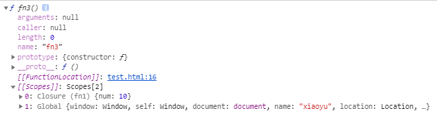

# JavaScript 执行上下文\_预解析\_AO_GO

## 执行上下文前言

执行上下文在 JavaScript 中是非常重要的知识，想要理解 JavaScript 的执行过程，执行上下文是你必须要掌握的知识，否则只能是知其然不知其所以然。

理解执行上下文有什么好处呢?

它他可以帮助你更好的理解代码的执行过程，作用域，闭包等关键知识点。特别是闭包它是 JavaScript 中的一个难点，当你理解了执行上下文再回头看闭包时，就会有豁然开朗的感觉。

这篇文章我们将深入了解 `执行上下文`，读完文章之后你应该可以清楚的了解到 JavaScript 解释器到底做了什么，为什么可以在一些函数和变量之前使用它，以及它们的值是如何确定的。

## JavaScript 是顺序执行?

如果要问到 JavaScript 代码执行顺序的话，想必写过 JavaScript 的开发者都会有个直观的印象，那就是顺序执行，毕竟：

```js
var foo = function () {
  console.log("foo1");
};

foo(); // foo1

var foo = function () {
  console.log("foo2");
};

foo(); // foo2

// 然而去看这段代码：

function foo() {
  console.log("foo1");
}

foo(); // foo2

function foo() {
  console.log("foo2");
}

foo(); // foo2
```

打印的结果却是两个 `foo2`。

刷过面试题的都知道这是因为 JavaScript 引擎并非一行一行地分析和执行程序，而是一段一段地分析执行。当执行一段代码的时候，会进行一个“准备工作”，比如第一个例子中的变量提升，和第二个例子中的函数提升。

但是本文真正想让大家思考的是：这个“一段一段”中的“段”究竟是怎么划分的呢？

到底 JavaScript 引擎遇到一段怎样的代码时才会做“准备工作”呢？

## 什么是执行上下文?

在 JavaScript 中运行代码时，代码的执行环境非常重要，通常是下列三种情况:

- Global code：代码第一次执行时的默认环境，即全局环境
- Function code：函数体中的代码
- Eval code：eval 函数内执行的文本(实际开发中很少使用，所以见到的情况不多)

举个例子，当执行到一个函数的时候，就会进行准备工作，这里的"准备工作"，就是**执行上下文(execution context)**

## 执行上下文堆栈

接下来问题来了，我们写的函数多了去了，如何管理创建的那么多执行上下文呢？

**所以 JavaScript 引擎创建了执行上下文栈(Execution Context Stack, ECS)来管理执行上下文**

为了模拟执行上下文的行为，让我们定义执行上下文栈是一个数组；

`ECStack = []`

试想当 JS 要开始解释执行代码的时候，最先遇到的就是全局代码，所以初始化的时候首先就会向执行上下文栈压入一个全局执行上下文，我们用来 `globalContext` 来表示它，并且只有当整个应用快结束的时候，`ECStack` 才会被清空，**所以 `ECStack` 底部永远有个 `globalContext`**

`ECStack = [ globalContext ]`

现在 JavaScript 遇到下面的代码了，

```js
function fun3() {
  console.log("fun3");
}

function fun2() {
  fun3();
}

function fun1() {
  fun2();
}

fun1();
```

**当执行一个函数的时候，就会创建一个执行上下文，并且压入执行上下文栈，当函数执行完毕的时候，就将该函数的执行上下文从执行上下文栈中弹出**，那么上下代码的处理如下：

```js
// 伪代码
ECStack.push(<fun1> functionContext)

// fun1 中竟然调用了 fun2，还要创建 fun2 的执行上下文
// ECStack.push(<fun2> functionContext)

// fun2 还调用了 fun3
// ECStack.push(<fun3> functionContext)

// fun3 执行完毕
// ECStack.pop()

// fun2 执行完毕
// ECStack.pop()

// fun1 执行完毕
// ECStack.pop()

// javascript 接着执行下面的代码，但是 ECStack 底层永远有个 globalContext
```

如下图可以清晰的表示执行堆栈的运作：


### 解答[思考题](JS复习第一弹\04_作用域和变量.md)

好啦，现在我们已经了解了执行上下文栈是如何处理执行上下文的，所以让我们看看文章[04\_作用域和变量](JS复习第一弹\04_作用域和变量.md)的思考题：

```js
var scope = "global scope";
function checkscope() {
  var scope = "local scope";
  function f() {
    return scope;
  }
  return f();
}
checkscope();

var scope = "global scope";
function checkscope() {
  var scope = "local scope";
  function f() {
    return scope;
  }
  return f;
}
checkscope()();
```

两段代码执行的结果一样，但是两段代码究竟有哪些不同呢？

答案就是**执行上下文栈的变化不一样**。

让我们模拟第一段代码：

```js
ECStack.push(<checkscope> functionContext);
ECStack.push(<f> functionContext);
ECStack.pop();
ECStack.pop();
```

让我们模拟第二段代码：

```js
ECStack.push(<checkscope> functionContext);
ECStack.pop();
ECStack.push(<f> functionContext);
ECStack.pop();
```

是不是有些不同呢？

当然了，这样概括的回答执行上下文栈的变化不同，是不是依然有一种意犹未尽的感觉呢，为了更详细讲解两个函数执行上的区别，我们需要探究一下执行上下文到底包含了哪些内容，所以请继续往下阅读。

## 变量对象(variable object, VO)

在上面讲到，当 JS 执行一段可执行代码(execution code)时，会创建执行上下文(execution context)

而对于每个执行上下文，都有三种重要的属性

- 变量对象(variable object, VO)
- 作用域链(Scope chain)
- this 指向

变量对象是与执行上下文相关的数据作用域，存储了在上下文中定义的变量和函数声明，或者 Arguments 对象。

因为不同执行上下文下的变量稍有不同，所以我们来聊聊全局上下文下的变量对象和函数上下文下的变量对象。

### 全局上下文

我们先了解一个概念，叫全局对象，在 [W3School](http://www.w3school.com.cn/jsref/jsref_obj_global.asp) 中也有介绍：

**全局对象就是预定义的对象，作为 JavaScript 的全局函数和全局属性的占位符。通过使用全局对象，可以访问所有其他预定义的对象、函数和属性**

**在顶层 JavaScript 代码中，可以用来关键字 this 引用全局对象。因为全局对象是作用域链的头，这意味着所有非限定性的变量和函数名都会作为该对象的属性来查询。**

**例如，当 JavaScript 代码引用 parseInt() 函数时，它引用的是全局对象的 parseInt 属性。全局对象是作用域链的头，这意味着在顶层 JavaScript 代码中声明的所有变量都将称为全局对象的属性**

如果看的不是很懂的话，容我再来介绍下全局对象:

1. 可以通过 this 引用，在客户端 JavaScript 中，全局对象就是 Window 对象。

```js
console.log(this);
```

2. 全局对象是由 Object 构造函数实例化的一个对象。

```js
console.log(this instanceof Object);
```

3. 预定义了一堆，嗯，一大堆函数和属性。

```js
// 都能生效
console.log(Math.random());
console.log(this.Math.random());
```

4. 作为全局变量的宿主。

```js
var a = 1;
console.log(this.a);
```

5. 客户端 JavaScript 中，全局对象有 window 属性指向自身。

```js
var a = 1;
console.log(window.a);

this.window.b = 2;
console.log(this.b);
```

花了一个大篇幅介绍全局对象，其实就想说：

**全局上下文中的变量对象就是全局对象呐！**

### 函数上下文

**在函数上下文中，我们用来活动对象(activation object, AO) 来表示变量对象**

**变量对象和活动对象其实是一个东西，只是变量对象是规范上的或者说是 JS 引擎上的，不可在 JavaScript 环境中访问，只有到进入一个执行上下文中，这个执行上下文的变量对象才会被激活，所以才叫 activation object，因此处于活动状态的执行上下文只有一个，而只有被激活的变量对象，也就是活动对象上的各种属性才能被访问**

**活动对象是在进入函数上下文时刻才被创建的，它通过函数的 arguments 属性初始化。arguments 属性值是 Arguments 对象**

### 执行过程

执行上下文的代码会分成个阶段进行处理：**预解析和执行**，我们也可以叫做：

1. 进入执行上下文
2. 代码执行

#### 进入执行上下文

**当进入执行上下文，这时候还没有执行代码**

变量对象会包括

1. 函数的所有形参(如果是函数执行上下文)

- 由名称和对应值组成的一个变量对象的属性被创建
- 没有实参，属性值设为 undefined

2. 函数声明

- 由名称和对应值(函数对象(function-object))组成一个变量对象的属性被创建
- 如果变量对象已经存在相同名称的属性，则完全替换该属性

3. 变量声明

- 由名称和对应值(undefined)组成一个变量对象的属性被创建
- 如果变量名称跟已经声明的形式参数或函数相同，则变量声明不会干扰已经存在的这类属性

##### 例子

```js
function foo(a) {
  var b = 2;
  function c() {}
  var d = function () {};

  b = 3;
}

foo(1);
```

在进入执行上下文后，这时候 AO 是：

```js
AO = {
  arguments: {
    0: 1,
    length: 1
  },
  a: 1,
  b: 3,
  c: reference to functionc() {},
  d: reference to FunctionExpression "d"
}
```

到这里变量对象的创建过程就介绍完了，让我们简洁的总结我们上述所说：

1. 全局对象下的变量对象初始化是全局对象
2. 函数上下文下的变量对象初始化只包括 Arguments 对象
3. 在进入执行上下文时会给变量对象添加形参、函数声明、变量声明等初始的属性值
4. 在执行代码阶段，会再次修改变量对象的属性值

### Arguments 对象

Arguments 对象是活动对象的一个属性，它包括如下属性：

- callee — 指向当前函数的引用
- length — 真正传递的参数个数
- properties-indexes (字符串类型的整数) 属性的值就是函数的参数值(按参数列表从左到右排列)。
- properties-indexes 内部元素的个数等于 arguments.length. properties-indexes 的值和实际传递进来的参数之间是共享的。

#### 思考题

1. 第一题

```js
function foo() {
  console.log(a);
  a = 1;
}

foo(); // ???

function bar() {
  a = 1;
  console.log(a);
}
bar(); // ???
```

第一段会报错：`Uncaught ReferenceError: a is not defined`。

第二段会打印：`1`。

**这是因为函数中的 "a" 并没有通过 var 关键字声明，所有不会被存放在 AO 中。**

第一次执行 console 的时候，AO 的值是：

```js
AO = {
  arguments: {
    length: 0,
  },
};
```

没有 a 的值，然后就会到全局去找，全局也没有，所以会报错。

当第二段执行 console 的时候，全局对象已经被赋予了 a 属性，这时候就可以从全局找到 a 的值，所以会打印 1。

2. 第二题

```js
console.log(foo);

function foo() {
  console.log("foo");
}

var foo = 1;
```

会打印函数，而不是 undefined 。

这是因为在进入执行上下文时，首先会处理函数声明，其次会处理变量声明，如果如果变量名称跟已经声明的形式参数或函数相同，则变量声明不会干扰已经存在的这类属性。

## 作用域链

在上面变量对象中讲到，当查找变量的时候，会先从当前上下文中的变量对象开始查找，如果没有找到，就会从父级(词法层面上的父级)执行上下文的变量对象中查找，一直找到全局上下文中的变量对象，也就是全局对象。这样**由多个执行上下文的变量对象构成的链表就叫做作用域链**

下面，让我们以一个函数的创建和激活两个时期来讲解作用域链是如何创建和变化的。

### 函数创建

在[作用域和变量](JS复习第一弹\04_作用域和变量.md)中讲到，**函数的作用域在函数定义的时候就已经决定了**

**这是因为函数有一个内部属性 [[scope]]，当函数创建的时候，就会保存所有父变量对象到其中，你可以理解 [[scope]] 就是所有父变量对象的层级链，但是注意，[[scope]] 并不代表完成的作用域链**

举个例子：

```js
function foo() {
  function bar() {}
}
```

**函数创建时**，各自的 [[scope]] 为：

```js
foo.[[scope]] = {
  globalContext.VO
}
bar.[[scope]] = {
  fooContext.AO,
  globalContext.VO
}
console.log(111)
```

### 函数激活

**当函数激活时，进入函数执行上下文，创建 AO/VO 后，就会将活动对象添加到作用域链的顶端**

**这时候执行上下文的作用域链，我们命名为 Scope**

`Scope = [AO].concat([[Scope]]);`

至此，作用域链创建完毕

### 捋一捋

以下面的例子为例，结合着之前讲的变量对象和执行上下文栈，我们来总结一下函数执行上下文中作用域链和变量对象的创建过程：

```js
var scope = "global scope";
function checkscope() {
  var scope2 = "local scope";
  return scope2;
}
checkscope();
```

执行过程如下：

1. checkscope 函数被创建，保存作用域链到内部属性 [[scope]]

```js
checkscope[[scope]] = [globalContext.VO];
```

2. 执行 checkscope 函数，创建 checkscope 函数执行上下文，checkscope 函数执行上下文被压入执行上下文栈

```js
ECStack = [checkscopeContext, globalContext];
```

3. checkscope 并不立即执行，开始准备工作，即预解析

3.1 复制函数 [[scope]] 创建作用域链

```js
checkscopeContext = {
  Scope: checkscope[[scope]],
};
```

3.2. 用 arguments 创建活动对象，随后初始化活动对象，加入形参，函数声明，变量声明

```js
checkscopeContext = {
  AO: {
    arguments: {
      length: 0,
    },
    scope2: undefined,
  },
};
```

4. 将活动对象压入 checkscope 压入作用域链顶端

```js
checkscopeContext = {
  AO: {
    arguments: {
      length: 0,
    },
    scope2: undefined,
  },
  Scope: [AO, [[Scope]]],
};
```

5. 准备工作做完，开始执行函数，随着函数的执行，修改 AO 的属性值

```js
checkscopeContext = {
  AO: {
    arguments: {
      length: 0,
    },
    scope2: "local scope",
  },
  Scope: [AO, [[Scope]]],
};
```

6. 找到 scope 的值，返回后函数执行完毕，函数上下文从执行上下文栈中弹出

`ECStack = [ globalContext ]`

## 执行上下文

### 思考题

在[作用域和变量](JS复习第一弹\04_作用域和变量.md)中，提出这样一道思考题：

```js
var scope = "global scope";
function checkscope() {
  var scope = "local scope";
  function f() {
    return scope;
  }
  return f();
}
checkscope();
```

```js
var scope = "global scope";
function checkscope() {
  var scope = "local scope";
  function f() {
    return scope;
  }
  return f;
}
checkscope()();
```

两段代码都会打印'local scope'。虽然两段代码执行的结果一样，但是两段代码究竟有哪些不同呢？

紧接着就在上面执行上下文堆栈中，讲到了两者的区别在于执行上下文栈的变化不一样，然而，如果是这样笼统的回答，依然显得不够详细， 下面详细的解析执行上下文栈和执行上下文的具体变化过程。

### 具体执行分析

我们分析第一段代码：

```js
var scope = "global scope";
function checkscope() {
  var scope = "local scope";
  function f() {
    return scope;
  }
  return f();
}
checkscope();
```

执行过程如下：

1. 执行全局代码，创建全局执行上下文，全局上下文被压入执行上下文栈中

`ECStack = [globalContext]`

2. 全局上下文初始化

```js
globalContext = {
  VariableObject: {
    global,
    scope,
    checkscope,
  },
};
```

3. **初始化的同时，checkscope 被创建**，保存作用域链到函数的内部属性 [[scope]]

**checkscope 的创建是在全局上下文初始化时，即外层函数执行时，内层函数被定义**

```js
checkscope[[scope]] = [globalContext.VO];
```

4. checkscope 执行，创建 checkscope 执行上下文，checkscope 执行上下文被压入执行上下文栈中

```js
ECStack = [checkscopeContext, globalContext];
```

5. checkscope 并不立即执行，开始准备工作，即预解析

- 复制 checkscope 内部属性 [[scope]] 创建作用域链
- 用来 arguments 创建活动对象
- 初始化活动对象，即加入形参、函数声明、变量声明
- 将活动对象压入 checkscope 作用域链顶端
- 同时 f 函数的执行上下文被创建，保存作用域链到 f 的 [[scope]]

```js
checkscopeContext = {
  AO: {
    arguments: {
      length: 0
    },
    scope: undefined,
    f: reference to function f(){}
  },
  Scope: [AO, globalContext.VO],
  this: undefined
}
```

6. 执行 f 函数，创建 f 函数执行上下文，f 函数执行上下文被压入执行上下文栈

```js
ECStack = [fContext, checkscopeContext, globalContext];
```

7. f 函数执行上下文初始化, 以下跟第 4 步相同：

- 复制函数 [[scope]] 属性创建作用域链
- 用 arguments 创建活动对象
- 初始化活动对象，即加入形参、函数声明、变量声明
- 将活动对象压入 f 作用域链顶端

```js
fContext = {
  AO: {
    arguments: {
      length: 0,
    },
  },
  Scope: [AO, checkscopeContext.AO, globalContext.VO],
  this: undefined,
};
```

8. f 函数执行，沿着作用域链查找 scope 值，返回 scope 值

9. f 函数执行完毕，f 函数上下文从执行上下文栈中弹出

```js
ECStack = [checkscopeContext, globalContext];
```

10. checkscope 函数执行完毕，checkscope 执行上下文从执行上下文栈中弹出

```js
ECStack = [globalContext];
```

第二段代码就留给大家去尝试模拟它的执行过程。

```js
var scope = "global scope";
function checkscope() {
  var scope = "local scope";
  function f() {
    return scope;
  }
  return f;
}
checkscope()();
```

不过，在下一篇《JavaScript 深入之闭包》中也会提及这段代码的执行过程

很多小伙伴在阅读其他文章时，大多数可能都是下面这样：

```js
/* 
  AO activation object(活跃对象, 函数上下文)
  AO = {
    1.寻找形参和变量声明
    2.实参值赋值给形参
    3.找函数声明, 并赋值
    4.执行
  }
  */

function test1(a, b) {
  console.log(a); // 1
  c = 0;
  var c;
  a = 5;
  b = 6;
  console.log(b); // 6
  function b() {}
  function d() {}
  console.log(b); // 6
}
test1(1); // 1 6 6
/* 
  AO = {
    1.寻找形参和变量声明
      a: undefined
      b: undefined
      c: undefined
    2.实参值赋值给形参
      a: 1
      b: undefined
      c: undefined
    3.找函数声明, 并赋值
      a: 1
      b: function b() {}
      c: undefined
      d: function d() {}
    4. 执行
      console.log(a) === 1
      a: 5
      b: 6
      c: 0
      console.log(b) === 6
      console.log(b) === 6
  }
*/
```

```js
/* 
  GO global object 全局上下文
  GO = {
    1.找变量
    2.找函数声明
    3.执行
  }
  GO 的 this 指向 window
 */

function test3() {
  var a = (b = 1);
  console.log(b); // 1 // window.b 暗示全局变量
}
test3();

/* 
  1. 看到 test3() {} -->> AO
    AO = {
      a: undefined
    }
    GO = {
      test3: function() {}
    }
  2. 看到 b 被直接赋值 -->> 暗示全局变量 -->> GO, 挂载到 window 下
    GO = {
      test3: function() {},
      b: 1
    }
  3. 继续 AO
    AO = {
      a: ?
    }
    a 的值由 b 赋予, 但是函数里没有, 所以找到 window 下的 b, 并赋值给 a
    AO = {
      a: ? -> 1
    }
*/
```

## 案例

```js
function foo(i) {
  var a = "hello";
  var b = function privateB() {};
  function c() {}
}
foo(22);
```

`foo(22)` 执行的时候，创建阶段(预解析)如下：

1. 寻找形参和变量声明

```js
fooExecutionContextObj = {
  scopeChain: {
    /*...*/
  },
  variableObject: {
    i: undefined, // 形参
    a: undefined,
    b: undefined,
  },
};
```

2. 实参值赋值给形参

```js
fooExecutionContextObj = {
  scopeChain: {
    /*...*/
  },
  variableObject: {
    arguments: {
      // 实参
      0: 22,
      length: 1,
    },
    i: 22, // 形参
    a: undefined,
    b: undefined,
  },
};
```

3. 寻找函数声明

```js
fooExecutionContextObj = {
  scopeChain: {
    /*...*/
  },
  variableObject: {
    arguments: {
      // 实参
      0: 22,
      length: 1,
    },
    i: 22, // 形参
    a: undefined,
    b: undefined,
    c: function () {},
  },
};
```

4. 确定 this 指向

```js
fooExecutionContextObj = {
  scopeChain: {
    /*...*/
  },
  variableObject: {
    arguments: {
      // 实参
      0: 22,
      length: 1,
    },
    i: 22, // 形参
    a: undefined,
    b: undefined,
    c: function () {},
  },
  this: {
    /*...*/
  },
};
```

5. 执行

```js
fooExecutionContextObj = {
  scopeChain: {
    /*...*/
  },
  variableObject: {
    arguments: {
      // 实参
      0: 22,
      length: 1,
    },
    i: 22, // 形参
    a: "hello",
    b: function privateB() {},
    c: function () {},
  },
  this: {
    /*...*/
  },
};
```

#### return 后的代码会预解析

```js
var a = 1;
function b() {
  console.log(a); // Function a
  a = 10;
  return; // return 不会阻止预解析，所以 a 被声明为函数
  function a() {}
}
b();
console.log(a); // 1

function foo() {
  function bar() {
    return 3;
  }
  return bar();
  function bar() {
    return 8;
  }
}
console.log(foo()); // 8
```

## 声明提前的原由

网上很多关于声明提前的内容，它是用来解释变量和函数在声明时会被提前到作用域的顶部。但是并没有人详细解释为什么会发生这种情况，有了刚才关于解释器如何创建活动对象（AO）的认知，我们将很容易看出原因。例如：

```js
(function () {
  console.log(typeof foo); // function pointer
  console.log(typeof bar); // undefined
  var foo = "hello",
    bar = function () {
      return "world";
    };
  function foo() {
    return "hello";
  }
})();
```

我们现在可以回答，为什么可以在声明之前访问 foo

在执行阶段之前，我们已经完成了创建阶段(预解析)，此时变量/函数已经被创建，所以当函数执行的时候 foo 可以被访问到

虽然 foo 被声明了两次，但是我们在创建阶段中说到，函数发现 `variableObject` 中存在相同名称时，会覆盖引用

## scopeChain 图示

```js
function fn1() {
  var num = 10;
  function fn3() {
    console.log(num);
  }
  return fn3;
}
var fn4 = fn1();
console.dir(fn1);
console.dir(fn4);
```


`fn1`在全局作用域下，所以它的作用域链上只有一个全局作用域



`fn1`执行的时候返回 `fn3` 并产生了闭包，所以 `fn3` 的作用域链上除了 全局作用域，还有一个 `fn2`

## 图解

这里分享一波图解，图的来源是该[视频]()截图：


## 参考

- [JavaScript 中的变量对象，简约却不简单（系列五）](https://juejin.cn/post/6844903974085066760)
- [Javascript 中你必须理解的执行上下文和调用栈](https://www.imooc.com/article/290503)
- [深入理解 javascript 执行上下文(Execution Context)](https://www.cnblogs.com/quyanhui/p/3972446.html)
- [变量对象](https://www.cnblogs.com/guaidianqiao/p/7762085.html)
- [执行上下文栈](https://www.cnblogs.com/guaidianqiao/p/7762078.html)
- [执行上下文](https://www.cnblogs.com/guaidianqiao/p/7762181.html)
- [作用域链](https://www.cnblogs.com/guaidianqiao/p/7762095.html)
