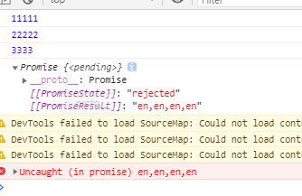

# Promise

## 测试

安装 [promises-aplus-tests](https://github.com/promises-aplus/promises-tests) 来验证你手写的 Promise 是否符合 Promises A+ 规范。

## 疑问

在 “我们都知道 JS 是单线程的, 那单线程是怎么实现异步的呢?
事实上所谓的"JS 是单线程的"只是指 JS 的主运行线程只有一个,
而不是整个运行环境都是单线程。JS 的运行环境主要是浏览器,
以大家都很熟悉的 Chrome 的内核为例, 他不仅是多线程的, 而且是多进程的”
这段话中，似乎可以理解为，setTimeout 是浏览器的，所以实现异步是很简单的，
那么对于 Promise 呢?

## 基本概念

```js
var p = new Promise((resolve, reject) => {
  /* executor */
});
```

Promise 是异步编程的一种解决方案

Promise 构造函数接收一个函数作为参数，该函数的两个参数分别是 resolve 和 reject。
resolve 函数的作用是将 Promise 对象的状态从 pending 变为 resolved，reject 函数的作用是将 Promise 对象的状态从 pending 变为 rejected。Promise 实例生成以后，可用 then 分别定制 resolved 状态和 rejected 状态的回调函数。

Promise 对象有以下两个特点：

1. 对象的状态不受外界影响
   Promise 对象代表一个异步操作，有三种状态：Pending，Fulfilled 和 Rejected。
   只有异步操作的结果可以决定当前是哪一种状态，任何其他操作都无法改变这个状态。
2. 一旦状态改变就不会再变，是不可逆的，任何时候都可以得到这个结果
   Promise 对象的状态改变只有两种可能，从 Pending 到 Fulfilled 或者从 Pending 到 Rejected。
   只要这两种状态改变，状态就凝固了，不会再变，而是一直保持这个结果，这时就称为 Resolved(已定型)，也叫当前 promise 对象处于 settled 状态，但是在平时大家都习惯将 Resolved 特指 Fulfilled 状态

## 需要注意的是：

> 如果一个 promise 被一个循环的 thenable 链中的对象解决，而 [[Resolve]](promise, thenable) 的递归性质又使得其被再次调用，根据上述的算法将会陷入无限递归之中。算法虽不强制要求，但也鼓励施者检测这样的递归是否存在，若检测到存在则以一个可识别的 TypeError 为拒因来拒绝 promise 3.6。

> 这里的“平台代码”意味着引擎，环境和 promise 实施代码，在实践中要确保 onFulfilled 和 onRejected 异步执行，且应该在 then 方法被调用的那一轮事件循环之后的新执行栈中执行。这个事件队列可以采用“宏任务（macro-task）”机制，类似于 setTimeOut 或者 setImmediate，也可以使用“微任务（micro-task）”机制来实现，类似于 MutationObserver 或 process.nextTick。因为 promise 实现被认为是平台代码，所以它本身可能包含一个任务调度队列或跳板，在其中调用处理程序。↩
> 在严格模式下 this 为 undefined，而在非严格模式中，this 为全局对象。↩
> 代码实现在满足所有要求的情况下可以允许 promise2 === promise1 。每个实现都要文档说明其是否允许以及在何种条件下允许 promise2 === promise1 。↩
> 总体来说，如果 x 符合当前实现，我们才认为它是真正的 promise 。这一规则允许那些特例实现接受符合已知要求的 Promises 状态。↩
> 这步我们先是存储了一个指向 x.then 的引用，然后测试并调用该引用，以避免多次访问 x.then 属性。这种预防措施确保了该属性的一致性，因为其值可能在检索调用时被改变。↩
> 实现不应该对 thenable 链的深度设限，并假定超出本限制的递归就是无限循环。只有真正的循环递归才应能导致 TypeError 异常；如果一条无限长的链上 thenable 均不相同，那么递归下去永远是正确的行为。↩

**then 必须返回一个 Promise**

**onFulfilled and onRejected must not be called until the execution context stack contains only platform code**

1. Promise 新建后就会立即执行
2. then 方法指定的回调函数将在下一步操作后执行
3. 既没有执行 resolve 也没有 reject 或抛出异常，那么 Promise 状态为 pending，此时他可能会被转换到 fulfilled 或 rejected
4. 一旦 Promise 被确定为 fulfilled 或者 rejected，都可以说 Promise 被 settled
5. 一个未被 settled 的 Promise 处于 pending 状态
6. resolve 和 reject 并不会终止 Promise 函数里 executor 的执行，例如：

```js
new Promise((resolve, reject) => {
  resolve(1);
  console.log(2);
}).then((res) => {
  console.log(res);
});
// 2
// 1
```

一般来说，调用 resolve 或 reject 以后，Promise 的使命就完成了，后继操作应该放到 then 方法里，而不应该直接写在 resolve 或 reject 的后面。所以，最好在他们前面加上 return 语句，这样就不会有意外。

```js
new Promise((resolve, reject) => {
  return resolve(1);
  // 后面的语句不会执行
  console.log(2);
});
```

7. Promise 状态一经确定(settled)，就不会再改变

```js
let pr = new Promise((res, rej) => {
  res("im fulfilled"); // 状态已确定，fulfilled
  console.log(11111); // 正常执行

  res("im fullfiled two"); // 被忽略
  console.log(22222); // 正常执行

  rej(new Error("im rejected")); // 被忽略
  throw new Error("hei, im exception"); // 被忽略
});
console.log("33333");

console.log(pr); // state -> fulfilled, value -> 'im fulfilled'
```


8. Promise 如果是异步确定状态的，那么在此之前处于 pending

- 栗子 1

```js
let pr = new Promise((res, rej) => {
  console.log(11111);
  setTimeout(res, 1000, "ha,ha,ha,ha");
  console.log(22222);
  setTimeout(res, 500, "en,en,en,en"); // settled
});

console.log(3333);

setTimeout(console.log, 1500, pr); // 状态已确定，settled，这里的状态由 settled 决定

console.log(pr); // 状态未确定，pending
```


**根据以上推论，如果 Promise 不 settled，即会一直处于 pending 状态**

至于为什么 pending 里会出现 `[[PromiseState]] -> fulfilled`，请看栗子 2

- 栗子 2

```js
let pr = new Promise((res, rej) => {
  console.log(11111);
  setTimeout(res, 1000, "ha,ha,ha,ha");
  console.log(22222);
  setTimeout(res, 500, "en,en,en,en"); // settled
});

console.log(3333);

console.log(pr); // 状态未确定，pending
```


如上，栗子 2 中在执行同步任务时，全局下的同步 console.log 打印出来的状态是该 setTimeout 的 callback 执行后的状态，而并非是因为异步导致全局下的 console.log 出来的状态为 pending，这里感觉像是 Promise executor 执行时，预解析了一次，看到 executor 有 settled 函数，从而确定了 Promise 的状态，而非是 pending

- 栗子 3

```js
let pr = new Promise((res, rej) => {
  console.log(11111);
  setTimeout(res, 1000, "ha,ha,ha,ha");
  console.log(22222);
  setTimeout(rej, 500, "en,en,en,en"); // settled
});

console.log(3333);

Promise.resolve(pr);

console.log(pr); // 状态未确定，pending
```



```js
let pr = new Promise((res, rej) => {
  console.log(11111);
  setTimeout(res, 1000, "ha,ha,ha,ha");
  console.log(22222);
  setTimeout(res, 500, "en,en,en,en"); // settled
});

console.log(3333);

Promise.reject(pr);

console.log(pr); // 状态未确定，pending
```


**由以上两个栗子可知，Promise.resolve(promise) 的状态和 Promise.rejecte(promise) 的状态都由其参数 promise 决定，即 Promise 状态依赖，而 Promise.reject 还会抛出未捕获异常的 Error**

9. Promise 是无法手动取消的

一个 promise 返回后由 `GC` 回收，并且在 JS 中没有提供关于对象的销毁方法，因此会一直存在当`当前宏任务`结束(使用 rxjs 库可以销毁 Promise)

10. 有可能会在一个回调失败之后继续使用链式操作，即，使用一个 catch，这对于在链式操作中抛出一个失败之后，再次进行新的操作会很有用，如果没有报错，则会跳过

```js
function task() {
  return new Promise((resolve, reject) => {
    setTimeout(() => {
      resolve("task");
    }, 1000);
  });
}

task()
  .then((res) => {
    console.log(res);
    return "taskB";
  })
  .then((res) => {
    console.log(res);
    return "taskC";
  })
  .then((res) => {
    console.log(res);
    throw new Error();
  })
  .catch((e) => {
    console.log(e);
    return "taskD";
  })
  .then((res) => {
    console.log(res);
  });
```


## thenable

Promise.resolve 除了能接收 Promise，它还能接收一个非 Promise 的 thenable 作为参数，他除了能接收一个已完成的 thenable，还能接收一个以拒绝的 thenable

```js
let thenable1 = {
  then(resolve, reject) {
    resolve(1);
  },
};

let p1 = Promise.resolve(thenable1);

p1.then((value) => console.log(value)); // 1

let thenable2 = {
  then(resolve, reject) {
    reject(1);
  },
};

let p2 = Promise.resolve(thenable2);

p2.catch((reason) => console.log(reason)); // 1
```

## 方法

iterable：一个可迭代对象，如 Array 或 String。

| 方法名                       | 功能                                                          | 返回结果                  |
| :--------------------------- | :------------------------------------------------------------ | :------------------------ |
| Promise.all(iterable)        | 所有传入的 promise 成功才触发成功，只要有一个失败就会触发失败 | 包含所有 promise 值的数组 |
| Promise.allSettled(iterable) | 所有传入的 promise 都完成（成功/失败）后完成                  | 包含所有 promise 值的数组 |
| Promise.any(iterable)        | 当第一个成功的 promise 成功时返回                             | 第一个成功的 promise 的值 |
| Promise.race(iterable)       | 当第一个 promise 成功/失败返回                                | 第一个完成的 promise 的值 |
| Promise.reject(reason)       | 返回一个状态为失败的 Promise 对象                             | 状态为失败的 Promise      |
| Promise.resolve(value)       | 返回一个状态由给定 value 决定的 Promise 对象                  | 状态为成功的 Promise      |

> 注意：Promise.any() 方法尚未被所有的浏览器完全支持。它当前处于 TC39 第四阶段草案（Stage 4）

## 原型属性

Promise.prototype.constructor：返回被创建的实例函数. 默认为 Promise 函数.

### 原型方法

| 方法名                                     | 功能                                          | 返回结果         | 说明                                                                                                                                     |
| :----------------------------------------- | :-------------------------------------------- | :--------------- | :--------------------------------------------------------------------------------------------------------------------------------------- |
| Promise.prototype.then(resolFun, rejecFun) | 添加 fulfilled 和 rejected 回调到当前 promise | 返回新的 promise | 当回调函数被调用，新 promise 都将以它的返回值来 resolve                                                                                  |
| Promise.prototype.catch(Fun)               | 添加一个 rejection 回调到当前 promise         | 返回新的 promise | 返回的 promise 会以 rejection 的返回值 resolve，Promise.prototype.catch()方法是.then(null, rejection)或.then(undefined, rejection)的别名 |
| Promise.prototype.finally(Fun)             | 当其中的一个 promise 成功时返回               | 返回新的 promise | 无论是 fulfilled 还是 rejected，都会执行，该方法是 ES2018 引入标准的。                                                                   |

## Promise 拒绝事件

当 Promise 被拒绝时，会有下文所述的两个事件之一被派发到全局作用域（通常而言，就是 window；如果是在 web worker 中使用的话，就是 Worker 或者其他 worker-based 接口）。这两个事件如下所示：

- [rejectionhandled](https://developer.mozilla.org/zh-CN/docs/Web/API/Window/rejectionhandled_event)
  当 Promise 被拒绝、并且在 reject 函数处理该 rejection 之后会派发此事件。
- [unhandledrejection](https://developer.mozilla.org/en-US/docs/Web/API/Window/unhandledrejection_event)
  当 Promise 被拒绝，但没有提供 reject 函数来处理该 rejection 时，会派发此事件。
  以上两种情况中，PromiseRejectionEvent 事件都有两个属性，一个是 promise 属性，该属性指向被驳回的 Promise，另一个是 reason 属性，该属性用来说明 Promise 被驳回的原因。

因此，我们可以通过以上事件为 Promise 失败时提供补偿处理，也有利于调试 Promise 相关的问题。在每一个上下文中，该处理都是全局的，因此不管源码如何，所有的错误都会在同一个处理函数中被捕捉并处理。

一个特别有用的例子：当你使用 Node.js 时，有些依赖模块可能会有未被处理的 rejected promises，这些都会在运行时打印到控制台。你可以在自己的代码中捕捉这些信息，然后添加与 unhandledrejection 相应的处理函数来做分析和处理，或只是为了让你的输出更整洁。举例如下：

```js
window.addEventListener(
  "unhandledrejection",
  (event) => {
    /* 你可以在这里添加一些代码，以便检查
     event.promise 中的 promise 和
     event.reason 中的 rejection 原因 */

    event.preventDefault();
  },
  false
);
```

调用 event 的 preventDefault() 方法是为了告诉 JavaScript 引擎当 Promise 被拒绝时不要执行默认操作，默认操作一般会包含把错误打印到控制台，Node 就是如此的。

理想情况下，在忽略这些事件之前，我们应该检查所有被拒绝的 Promise，来确认这不是代码中的 bug。

## 在旧式回调 API 中创建 Promise

可以通过 Promise 的构造器从零开始创建 Promise。 这种方式（通过构造器的方式）应当只在封装旧 API 的时候用到。

理想状态下，所有的异步函数都已经返回 Promise 了。但有一些 API 仍然使用旧方式来传入的成功（或者失败）的回调。典型的例子就是 setTimeout() 函数：

```js
setTimeout(() => saySomething("10 seconds passed"), 10000);
```

混用旧式回调和 Promise 可能会造成运行时序问题。如果 saySomething 函数失败了，或者包含了编程错误，那就没有办法捕获它了。这得怪 setTimeout。

幸运地是，我们可以用 Promise 来封装它。最好的做法是，将这些有问题的函数封装起来，留在底层，并且永远不要再直接调用它们：

```js
const wait = (ms) => new Promise((resolve) => setTimeout(resolve, ms));

wait(10000)
  .then(() => saySomething("10 seconds"))
  .catch(failureCallback);
```

通常，Promise 的构造器接收一个执行函数(executor)，我们可以在这个执行函数里手动地 resolve 和 reject 一个 Promise。既然 setTimeout 并不会真的执行失败，那么我们可以在这种情况下忽略 reject。

## Promise 实现 Ajax

```js
const getJSON = function (url) {
  const promise = new Promise(function (resolve, reject) {
    const handler = function () {
      if (this.readyState !== 4) {
        return;
      }
      if (this.status === 200) {
        resolve(this.response);
      } else {
        reject(new Error(this.statusText));
      }
    };
    const client = new XMLHttpRequest();
    client.open("GET", url);
    client.onreadystatechange = handler;
    client.responseType = "json";
    client.setRequestHeader("Accept", "application/json");
    client.send();
  });

  return promise;
};

getJSON("/posts.json").then(
  function (json) {
    console.log("Contents: " + json);
  },
  function (error) {
    console.error("出错了", error);
  }
);
```

## Promise A+ 规范

[原文](https://juejin.cn/post/6844904181136900109)

### 前言：必要前提

阅读本文有一个很重要的前提—— 就是知道 Promise 是怎么构造的，也可以说知道在构造 Promise 实例过程中究竟发生了什么，是理解 Promise 必不可缺的关键一步。
试着问下自己这几个问题：

- Promise 的接收的回调函数是怎么执行的？（MDN 称之为 executor）
- resolve 和 reject 是什么？ 是谁提供的？
- 返回的 Promise 是怎么确定状态的？

如果回答这些问题没有把握，可以参考：

- [MDN Promise](https://developer.mozilla.org/zh-CN/docs/Web/JavaScript/Guide/Using_promises)
- [Promise 简介](https://juejin.im/post/6844904178423169037)
- 其他博文：尽可能是 github 上的，分析得头头是道、有理有据，但有些难理解就是了。

如果上面的问题都能很好的回答上来，那么就正式开始用 Promise/A+规范解读 Promise（虽说如此，还是要结合 MDN 和 tutorialpoint 上的内容）。
开始吧。

### 预备：Promise 基本构造（非规范）

注意：

- 这不是 Promise/A+的一部分，但是知道它对于理解 Promise 规范的细节很有帮助。
- 下面的内容我会在括号中引用，或是在伪代码中引用。

任何一个 Promise 都会有两个最关键的部分：

- [[PromiseStatus]] : 表明操作执行后的状态。默认为 pending ； 在 Firefox 浏览器中，该字段为 state
- [[PromiseValue]] ：是保存在 Promise 中的结果，它可能是一个 reason（拒绝原因，异常.etc）； 或是一个 value（成功操作后提供的结果）。

关于[[PromiseStatus]]和[[PromiseValue]]的设置：

1. 在调用 resolve 函数时，如果提供了参数 y； 那么[[PromiseValue]]则被设为 y 的值。此时[[PromiseStatus]]将切换为 fulfilled （或 resolved） ； 例如：resolve(y)
2. 在调用 reject 函数时，如果提供了异常或一个值 r, 那么[[PromiseValue]]将被设为 r。它可能是一个异常（Exception）。此时[[PromiseStatus]]将切换为 rejected。 例如：reject(r)或 throw r

一旦[[PromiseStatus]]被设为 fulfilled 或 rejected 二者任何一个状态，都可以说该 Promise 被 settled。
总结如下：
任何一个 Promise 实例 pr 的 value 或 reason 都能表示为：

> pr . [[PromiseValue]] // 它可能是 value ，也可能是 reason。

任何一个 Promise 实例 pr 的状态都能表示为：

> pr . [[PromiseStatus]] // pending / fulfilled / rejected 三者之一。

### Promise 与 then 方法

注意：

- 参考来源： [Promise/A+规范](https://promisesaplus.com/)
- 虽然是参考规范，但是并非是规范的翻译，小生也没有翻译规范的能力；下文大多是阅读规范后的理解。

Promise/A+规范规定，Promise 必须为以下三种状态之一：

1. pending ： 操作还未确定结果。此时 promise 状态（即[[PromiseStatus]]）可以切换到 fulfilled 或 rejected
2. fulfilled：操作已经成功完成。无法再切换到其他状态。此时必须有一个确定的 value（即[[PromiseValue]]无法再更改）
3. rejected：操作已经失败。无法再切换到其他状态。此时必须有一个确定的 reason（即[[PromiseValue]]无法再更改）

任何一个 promise 实例都必须有一个 then 方法；同样的，任何具有 then 方法的对象都可以称之为 thenable 对象。
如下所示：

> promise.then(onFulfilled, onRejected)

1. onFulfilled 与 onRejected 都是可选的，但是它们如果不是函数，都会被忽略。注意它们只能在 promise 被 settled 后调用并且只能被调用一次。
2. onFulfilled 是一个函数时，promise 的状态为 fulfilled 时被调用。并将 promise 的 value（即[[PromiseValue]]）作为 onFulfilled 的第一个参数。
3. onRejected 是一个函数时，promise 的状态为 rejected 状态时被调用，并且 promise 的 reason（也是[[PromiseValue]]） 作为它的第一个参数。

注意：

- 只有在当前任务（即宏任务）完成后才能调用 onFulfilled 与 onRejected 回调；如果当前宏任务未执行完毕，那么它们都不能被调用。 这保证了 then 是异步的。
- 一个 then 方法可以被同一个 promise 调用多次。

写一个伪代码：

```js
promise.then(
  (value) => {
    // onFulfilled callback
    // [[PromiseStatus]] === fulfilled
    // [[PromiseValue]] === value
  },
  (reason) => {
    // onRejected callback
    // [[PromiseStatus]] === rejected
    // [[PromiseValue]] === reason
  }
);
```

then 方法必须返回一个 Promise 实例
在知道怎么将返回值转换为 promise 前，必须知道[[Resolve]]（有大佬译作 promise 解决程序，我就借用了）

### Promise 解决程序[[Resolve]]

[[Resolve]]是一个抽象操作，即：将 x 转换为 Promise 实例 promise1 的过程记作[[Resolve]](promise1,x)。这里 x 可以是任何类型的值，如 undefined、primitive data（原始值）、thenable 对象等等。
伪代码如下：

```js
x, promise1[[Resolve]](promise1, x); // x 是任何值。 // 执行 Promise 解决程序， x 和 promise 作为参数

promise1; // 是根据值 x 转换得到的 Promise 实例值。
```

注意：

- 再次重申， thenable 是拥有 then 方法的对象。
- 为了防止混淆， 我会将 Promise 实例称作 promise1，而不是规范中的 promise。
- 过程我会排除掉一些少见情形，例如 x 和 promise1 是相同时，会抛出 TypeError 错误等等。必要时我会带上。

#### [[Resolve]](promise1,x) 过程如下:

##### PA:

- 假定： x 是一个 Promise 实例，那么：

1. 如果 x 处于 pending 状态，那么 promise1 状态也将为 pending； 直至 x 切换到 fulfilled 或 rejected 状态为止。
2. 如果 x 处于 fulfilled 状态，promise1 也将切换到 fulfilled 状态，并将 promise1 的 value（即 promise1.[[PromiseValue]]，下同）也设为 x 的 value
3. 如果 x 处于 rejected 状态，promise1 也将切换到 rejected 状态，并将 promise1 的 reason（也是 promise1.[[PromiseValue]]，下同）也设为 x 的 reason

##### PB:

- 假定： x 不可能是 Promise 实例；
- 假定： x 是一个对象或函数。
- 假设 then 为 x.then ；即 then = x.then ；

1. 若取属性 x.then 抛出异常 er， 那么将 promise1 的 reason 设为 er，并将 promise1 的状态（即 promise1 . [[PromiseStatus]]，下同）设为 rejected
2. 如果 then 是一个函数，那么进入 PC； 此时 x 为 thenable 对象
3. 如果 then 不是一个函数 （注意：x 也是一个对象或函数）， 此时 x 不是 thenable 对象； 那么将 promise1 的状态设为 fulfilled，并将 promise1 的 value 设为值 x 。

##### PC:

- 此时 x 必须是一个 thenable 对象
- 假定 then 是 x.then
- 假定 x 对象定义如下：

```js
x = {
  ....
  then(resolvePromise, rejectPromise){ // resolvePromise, rejectPromise 是回调函数
    ...
    ...
  }
}
```

1. 将 then 方法的 this 指向 x，并调用 then 方法； 注意 then 方法接收两个回调函数。
2. 如果在调用 resolvePromise 时提供了一个参数 y， 即 resolvePromise(y)；那么执行[[Resolve]](promise1, y) ； 这里是一个递归。
3. 如果在调用 rejectPromise 时提供了一个参数 r， 即 rejectPromise(y) ; 那么将 promise1 的 reason 设为 r；并且 promise1 的状态也会切换到 rejected。
4. 如果 resolvePromise 和 rejectPromise 都被数次调用，那么优先第一个调用，其余调用都将被忽略。
5. 如果 then 方法内部抛出一个异常 e：

- 如果 resolvePromise 和 rejectPromise 已经被调用，那么忽略它。
- 否则，将 promise1 的 reason 设为 e；并且将并且 promise1 的状态切换到 rejected

##### PD:

- x 不是 Promise 实例
- x 不是对象或函数。

1. 将 promise1 的状态设为 fulfilled，并且将 promise1 的 value 设为 x。

then 返回值解析：
例如：

> promise2 = promise1.then(onFulfilled, onRejected);

1. onFulfilled 或 onRejected 返回一个值 x。 执行[[Resolve]](promise2, x)
2. onFulfilled 或 onRejected 如果抛出一个异常 e。那么 promise2 状态切换为 rejected，其 reason 设为 e
3. 当 onFulfilled 或 onRejected 都不是函数时，则：

- 如果 promise1 处于 fulfilled 状态，那么 promise2 也必须切换到 fulfilled 状态，并且将 promise2 的 value 设为 promise1 的 value
- 如果 promise1 处于 rejected 状态，那么 promise2 也必须切换到 rejected 状态，并且将 promise2 的 reason 设为 promise1 的 reason

### okay. 验证

#### 情形 1： x 为 Promise 实例

```js
var pr0 = Promise.reject("wrong,ha,ha,..");
var pr1 = pr0.then(undefined, (r) => {
  return Promise.reject("Madadesu");
});
console.log(pr1); // pending
setTimeout(console.log, 0, pr1);
pr1.catch(() => {});
```

输出：


参考 **规则 PA.3 **

#### 情形 2：x 是非 thenable 的对象

```js
var pr0 = Promise.resolve({ name: "Tadashi", age: 30 });
console.log(pr0);
```

输出：


#### 参考 规则 PB.3

情形 3：x 是一个 thenable 对象

```js
var x = {
  name: "tadane",
  age: 30,
  then(res, rej) {
    res(this.name + " " + this.age);
    console.log(11111); // 输出

    rej("tareru out!!");
    console.log(22222); // 输出

    throw new Error("....");
    console.log(3333); // 未执行
  },
};
var pr0 = Promise.resolve(x);
setTimeout(console.log, 0, pr0);
```

输出：


参考规则 PC.2。

#### 情形 4：抛出异常

```js
var x = {
  name: "tadane",
  age: 30,
  then(res, rej) {
    throw new Error("bad js");
  },
};
var pr0 = Promise.resolve(x);
setTimeout(console.log, 0, pr0);
pr0.catch((e) => {
  console.log(e.message);
});
```

仍然是 PC。其次，即使是在其他情形中，一旦抛出异常，promise 也总是被设为 rejected。


#### 情形 5： x 为原始值或 undefined

```js
var p0 = Promise.reject("bad js");
var p1 = p0.then(null, (r) => {
  return 1111;
});
setTimeout(console.log, 0, p1);
```

输出


参考规则 PD
常见情形就这么几个例子吧。
如果有其他的，可以自行验证

### 画个图

哎，我也搞个图。


原本想带上 catch、 finally 什么的；但发现算了。概念又都堆到一起去了。而且这些本来就没什么难度，所以就跳过吧。

## 手写 Promise

## 参考

- [Promises/A+](https://promisesaplus.com/)
- [Promise A+ 规范](https://js.yanceyleo.com/docs/Promise/promiseA+/)
- [精读 JS 系列（9b） Promise — 回调地狱、Promise 构造器](https://juejin.cn/post/6844904178423169037)
- [精读 JS 系列（10）Promise—参考 Promise/A+规范解读 Promise](https://juejin.cn/post/6844904181136900109)
- [使用 Promise](https://developer.mozilla.org/zh-CN/docs/Web/JavaScript/Guide/Using_promises)
- [Window: unhandledrejection event](https://developer.mozilla.org/en-US/docs/Web/API/Window/unhandledrejection_event)
- [Window: rejectionhandled event](https://developer.mozilla.org/zh-CN/docs/Web/API/Window/rejectionhandled_event)
- [Javascript 异步的发展与 6 种解决方案总结](https://juejin.cn/post/6904146151922991118?utm_source=gold_browser_extension)
- [从 Promise 基本用法，实现手写 Promise](https://juejin.cn/post/6854573212223668232)
- [Promise](https://js.yanceyleo.com/docs/Promise/promise/)
- [异步系列 - Promise](https://github.com/LiangJunrong/document-library/blob/master/%E7%B3%BB%E5%88%97-%E9%9D%A2%E8%AF%95%E8%B5%84%E6%96%99/JavaScript/%E5%BC%82%E6%AD%A5%E7%B3%BB%E5%88%97/Promise.md)
- [【全网首发更新完】迭代器~生成器~promise~async、await](https://www.bilibili.com/video/BV1mp4y1z7KB)
- [Promise 面试题 由易到难一网打净](https://www.bilibili.com/video/BV1uT4y1M7WZ)
- [【 Promise 面试题 】由易到难一网打净](https://www.bilibili.com/video/BV1bK41137fq)
<!--  -->
- [解读Promise内部实现原理](https://juejin.cn/post/6844903521284784142)
- [手写 Promise](https://js.yanceyleo.com/docs/Promise/promiseWheel/)
- [100 行代码实现 Promises/A+ 规范](https://juejin.cn/post/6903725134977171463#heading-5)
- [手写源码系列 - Promise](https://github.com/LiangJunrong/document-library/blob/master/%E7%B3%BB%E5%88%97-%E9%9D%A2%E8%AF%95%E8%B5%84%E6%96%99/JavaScript/%E6%89%8B%E5%86%99%E6%BA%90%E7%A0%81%E7%B3%BB%E5%88%97/Promise.md)
- [闲着无聊，写个 promise](https://juejin.cn/post/6904135600539074574?utm_source=gold_browser_extension)
- [从 Promise 基本用法，实现手写 Promise](https://juejin.cn/post/6854573212223668232#heading-3)
- [Promise 入门到自定义](https://juejin.cn/post/6854573220704714765#heading-6)
- [异步系列 - Promise](https://github.com/LiangJunrong/document-library/blob/master/%E7%B3%BB%E5%88%97-%E9%9D%A2%E8%AF%95%E8%B5%84%E6%96%99/JavaScript/%E5%BC%82%E6%AD%A5%E7%B3%BB%E5%88%97/Promise.md)
