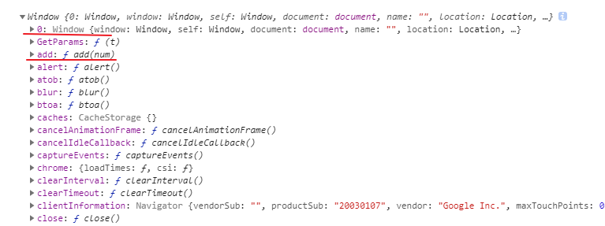

# 每天的任务

## 2020-01-30

### MDN

#### [Getting_started](https://developer.mozilla.org/zh-CN/docs/Learn/Getting_started_with_the_web/JavaScript_basics)

1. 我们将 [`<script>`](https://developer.mozilla.org/zh-CN/docs/Web/HTML/Element/script) 放在 HTML 文件的底部附近的原因是浏览器会按照代码在文件中的顺序加载 HTML。如果先加载的 JavaScript 期望修改下方的 HTML，那么它可能由于 HTML 尚未加载而失效。因此将 JavaScript 代码放在 HTML 页面的底部附近通常是最好的策略。

2. [textContent](https://developer.mozilla.org/zh-CN/docs/Web/API/Node/textContent)
   节点变量的属性，用于获取或设置节点变量的文本

3. 数据类型

- Array: 用于在单一引用中存储多个值的结构
- Object：JavaScript 里一切皆对象，一切皆可储存在变量里。

4. 运算符

- [运算符](https://developer.mozilla.org/en-US/docs/Glossary/Operator)是一类数学符号，可以根据两个值(或变量)产生结果。注：这里说"根据两个值(或变量)产生结果是不严谨的，计算两个变量的运算符称为'二元运算符'，还有一元运算符和三元运算符。"

- 不同数据类型之间的计算可能出现奇怪的结果，因此必须正确引用变量，才能得出预期结果。比如在控制台输入 "35" + "25"，为什么不能得到 60? 因为引号将数字转换成了字符串，所以结果是连接连接两个字符串而不是把两个数字相加。输入 35 + 25 才能得到正确的结果。

5. [return](https://developer.mozilla.org/zh-CN/docs/Web/JavaScript/Reference/Statements/return) 语句告诉我们浏览器当前返回 result 变量。这一点很是必要，因为函数内定义的变量只能在函数内使用。这叫做变量的[作用域](https://developer.mozilla.org/zh-CN/docs/Glossary/Scope)。(详见[变量作用域](https://developer.mozilla.org/zh-CN/docs/Web/JavaScript/Guide/Values,_variables,_and_literals#Variable_scope))

6. null
   这是 JavaScript 的一个特殊值，表示引用不存在。

#### [Introduction](https://developer.mozilla.org/zh-CN/docs/Web/JavaScript/Guide/Introduction)

1. 什么是 JavaScript?

JavaScript 是一门跨平台、面向对象的脚本语言，它能使网页可交互（例如拥有复杂的动画，可点击的按钮，通俗的菜单等）。另外还有高级的服务端 Javascript 版本，例如 Node.js，它可以让你在网页上添加更多功能，不仅仅是下载文件（例如在多台电脑之间的协同合作）。在宿主环境（例如 web 浏览器）中， JavaScript 能够通过其所连接的环境提供的编程接口进行控制。

2. JavaScript 和 Java

JavaScript 和 Java 有一些共性但是在另一些方面有着根本性区别。JavaScript 语言类似 Java 但是并没有 Java 的静态类型和强类型检查特性。JavaScript 遵循了 Java 的表达式语法，命名规范以及基础流程控制，这也是 JavaScript 从 LiveScript 更名的原因。

与 Java 通过声明的方式构建类的编译时系统不同，JavaScript 采用基于少量的数据类型如数字、布尔、字符串值的运行时系统。JavaScript 拥有基于原型的对象模型提供的动态继承；也就是说，独立对象的继承是可以改变的。 JavaScript 支持匿名函数。 函数也可以作为对象的属性被当做宽松的类型方式执行。

相比之下，JavaScript 传承了 HyperTalk 和 dBASE 语句精简、动态类型等精髓，这些脚本语言为更多开发者提供了一种语法简单、内置功能强大以及用最小需求创建对象的编程工具。

| JavaScript                                                                         | Java                                                                                   |
| :--------------------------------------------------------------------------------- | :------------------------------------------------------------------------------------- |
| 面向对象。不区分对象类型。通过原型机制继承，任何对象的属性和方法均可以被动态添加。 | 基于类系统。分为类和实例，通过类层级的定义实现继承。不能动态增加对象或类的属性或方法。 |
| 变量类型不需要提前声明(动态类型)。                                                 | 变量类型必须提前声明(静态类型)。                                                       |
| 不能直接自动写入硬盘。                                                             | 可以直接自动写入硬盘。                                                                 |

3. JavaScript 和 ECMAScript 规范

JavaScript 的标准化组织是 [ECMA](http://www.ecma-international.org/) ——这个欧洲信息与通信系统标准化协会提供基于 Javascript 的标准化方案（ECMA 原先是欧洲计算机制造商协会的首字母缩写）。这种标准化版本的 JavaScript 被称作 ECMAScript，在所有支持该标准的应用中以相同的方式工作。公司可以使用开放标准语言来开发他们自己的 JavaScript 实现版本。ECMAScript 标准在 ECMA－262 规范中进行文档化。 参照 [JavaScript 的新特性](https://developer.mozilla.org/en-US/docs/Web/JavaScript/New_in_JavaScript) 以便学习更多关于不同版本的 JavaScript 和 ECMAScript 规范版本。

ECMA-262 标准也通过了 国际标准化组织（[ISO](http://www.iso.ch/)）的 ISO-16262。你可以[在这里](http://www.ecma-international.org/publications/standards/Ecma-262.htm)找到该规范文件。 ECMAScript 规范并没有描述文档对象模型（DOM），该模型由 [万维网联盟](http://www.w3.org/)（W3C） 制定。DOM 定义了 HTML 文件对象被脚本操作的方法。为了更清楚地了解当使用 JavaScript 编程时用到的不同技术，请参阅 [JavaScript 技术概述](https://developer.mozilla.org/zh-CN/docs/Web/JavaScript/JavaScript_technologies_overview)。

4. JavaScript 文献和 ECMAScript 规范

ECMAScript 规范是实现 ECMAScript 的一组需求;如果您想在 ECMAScript 实现或引擎(如 Firefox 中的 SpiderMonkey 或 Chrome 中的 V8)中实现符合标准的语言特性，那么它是非常有用的。

ECMAScript 文档不是用来帮助脚本程序员的;使用 JavaScript 文档获取关于编写脚本的信息。

ECMAScript 规范使用了 JavaScript 程序员可能不熟悉的术语和语法。尽管 ECMAScript 中对语言的描述可能有所不同，但语言本身保持不变。JavaScript 支持 ECMAScript 规范中列出的所有功能。

JavaScript 文档描述了适合 JavaScript 程序员的语言方面。

## 2020-01-31

### MDN

[Grammar and types](https://developer.mozilla.org/zh-CN/docs/Web/JavaScript/Guide/Grammar_and_Types)

JavaScript 借鉴了 Java 的大部分语法，但同时也受到 Awk，Perl 和 Python 的影响。

JavaScript 使用 Unicode 字符集。

在 JavaScript 中，指令被称为语句([Statement](https://developer.mozilla.org/zh-CN/docs/Glossary/Statement))，并使用逗号分隔。

**JavaScript 源码从左往右被扫描并转换成一系列 tokens, control characters, line terminators, comments or whitespace.(Spaces, tabs, and newline characters are considered whitespace.)**

在代码执行过程中，注释将被自动跳过(不执行)

#### JavaScript 声明的三种方式：

- var：声明一个变量，可选初始化一个值
- let：声明一个块作用域的局部变量，可选初始化一个值
- const：声明一个块作用域的只读常亮

#### 声明变量的三种方式：

- var：这个语法可以用来声明局部变量和全局变量
- <a id="直接赋值声明">直接赋值</a>：在函数外使用这种形式赋值，会产生一个全局变量。在严格模式下会报错。
- let：这个语法可以用来声明块作用域的局部变量

#### 变量求值：

**如果访问一个未声明的变量会抛出一个 ReferenceError 异常**

数值类型环境中，undefined 会被转换为 NaN

当你对一个 null 变量求值时，空值 null 在数值环境中会被当作 0 来对待，而布尔环境中会被当作 false

#### 变量的作用域：

ECMAScript 6 之前的 JavaScript 没有[语句块](https://developer.mozilla.org/zh-CN/docs/JavaScript/Guide/Statements#Block_Statement)作用域；相反，语句块中的声明的变量将成为语句块所在函数(或全局作用域)的局部变量。例如，如下的代码将在控制台输出 5，因为 x 的作用域是声明了 x 的那个函数(全局范围)，而不是 if 语句块

```js
if (true) {
  var x = 5
}
console.log(x) // 5
```

如果使用 let，上述行为将发生变化

```js
if (true) {
  let y = 5
}
console.log(y) // ReferenceError: y 没有被声明
```

#### 变量提升

JavaScript 变量的另一个不同寻常的地方是，你可以先使用变量稍后再声明变量而不会引发异常。这一概念称为变量提升；JavaScript 变量感觉上是被"提升"或移到了函数或语句的最前面。但是，提升后的变量将返回 undefined 值。因此在使用或引用某个变量之后进行声明和初始化操作，这个被提升的变量仍将返回 undefined 值。

- let 的暂时性死区

**在 ECMAScript6 中，let(const) 中同样会被提升变量到代码块的顶部但是不会被赋予初始值。在变量声明之前引用这个变量，将抛出引用错误(ReferenceError)。这个变量将从代码块一开始的时候就处在一个"暂时性死区"，直到这个变量被声明为止。**

#### 函数提升

对于函数来说，只有函数声明会被提升到顶部，而函数表达式不会被提升。

#### 全局变量

你可以通过指定 window 或 frame 的名字，在当前 window 或 frame 访问另一个 window 或 frame 中声明的变量。例如，在文档里声明一个叫 phoneNumber 的变量，那么你就可以在子框架里使用 parent.phoneNumber 的方式来引用它。

##### iframe

正如上面所说，frame 是子框架的时候，可以使用 parent 关键字来获取引用该 frame 的父框架的 Windows 下的声明的方法，parent 指向父框架的 Windows 全局对象，而父框架的 parent 如果没有被其他框架所引用，那么 parent 指向自己，同时 parent[0] 指向自己，如下：

```html
<!-- index.html -->
<script>
  function add2() {}
  let a = 1
  console.log(parent.add2)
  console.log(parent.a)
</script>
<!-- text.html -->
<iframe src="./index.html" frameborder="1"></iframe>

<script>
  console.log(parent.parent)
  console.log(this)
  console.log()
  // Model
  function add(num) {
    return num + 1
  }
  let a = 1
  console.log(this.a)
  console.log(this.add)
  console.log(this.add2)
  console.log(window.a)
</script>
```




#### 数据类型

最新的 ECMAScript 标准定义了 8 种数据类型：

- 七种基本数据类型:
- - 布尔值(Boolean)，有 2 个值分别是：true 和 false.
- - null ， 一个表明 null 值的特殊关键字。 JavaScript 是大小写敏感的，因此 null 与 Null、NULL 或变体完全不同。
- - undefined ，和 null 一样是一个特殊的关键字，undefined 表示变量未赋值时的属性。
- - 数字(Number)，整数或浮点数，例如： 42 或者 3.14159。
- - 任意精度的整数 (BigInt) ，可以安全地存储和操作大整数，甚至可以超过数字的安全整数限制。
- - 字符串(String)，字符串是一串表示文本值的字符序列，例如："Howdy" 。
- - 代表(Symbol) ( 在 ECMAScript 6 中新添加的类型)。一种实例是唯一且不可改变的数据类型。
- 以及对象(Object)。

##### 字符串转换为数字

有一些方法可以将内存中表示一个数字的字符串转换为对应的数字。

parseInt() 和 parseFloat()

参见：[parseInt()](https://developer.mozilla.org/zh-CN/docs/JavaScript/Reference/Global_Objects/parseInt)和[parseFloat()](https://developer.mozilla.org/zh-CN/docs/JavaScript/Reference/Global_Objects/parseFloat)的相关页面。

parseInt 方法只能返回整数，所以使用它会丢失小数部分。另外，调用 parseInt 时最好总是带上进制(radix) 参数，这个参数用于指定使用哪一种进制。

将字符串转换为数字的另一种方法是使用一元加法运算符。

#### 字面量

(译注：字面量是由语法表达式定义的常量；或，通过由一定字词组成的语词表达式定义的常量)

**在 JavaScript 中，你可以使用各种字面量。这些字面量是脚本中按字面意思给出的固定的值，而不是变量。(译注：字面量是常量，其值是固定的，而且在程序脚本运行中不可更改，比如 false，3.1415，thisIsStringOfHelloworld ，invokedFunction: myFunction("myArgument"))。**

本节将介绍以下类型的字面量：

- [数组字面量(Array literals)](<https://developer.mozilla.org/zh-CN/docs/Web/JavaScript/Guide/Grammar_and_types#%E6%95%B0%E7%BB%84%E5%AD%97%E9%9D%A2%E9%87%8F(Array_literals)>)
- [布尔字面量(Boolean literals)](<https://developer.mozilla.org/zh-CN/docs/Web/JavaScript/Guide/Grammar_and_types#%E5%B8%83%E5%B0%94%E5%AD%97%E9%9D%A2%E9%87%8F(Boolean_literals)>)
- [浮点数字面量(Floating-point literals)](<https://developer.mozilla.org/zh-CN/docs/Web/JavaScript/Guide/Grammar_and_types#%E6%B5%AE%E7%82%B9%E6%95%B0%E5%AD%97%E9%9D%A2%E9%87%8F(Floating-point_literals)>)
- [整数(Integers)](<https://developer.mozilla.org/zh-CN/docs/Web/JavaScript/Guide/Grammar_and_types#%E6%95%B4%E6%95%B0(Integers)>)
- [对象字面量(Object literals)](<https://developer.mozilla.org/zh-CN/docs/Web/JavaScript/Guide/Grammar_and_types#%E5%AF%B9%E8%B1%A1%E5%AD%97%E9%9D%A2%E9%87%8F(Object_literals)>)
- [RegExp literals](https://developer.mozilla.org/zh-CN/docs/Web/JavaScript/Guide/Grammar_and_types#RegExp_literals)
- [字符串字面量(String literals)](<https://developer.mozilla.org/zh-CN/docs/Web/JavaScript/Guide/Grammar_and_types#%E5%AD%97%E7%AC%A6%E4%B8%B2%E5%AD%97%E9%9D%A2%E9%87%8F(String_literals)>)

##### 数组字面量

数组字面值是一个封闭在方括号对([])中的包含有零个或多个表达式的列表，其中每个表达式代表数组的一个元素。当你使用数组字面值创建一个数组时，该数组将会以指定的值作为其元素进行初始化，而其长度被设定为元素的个数。

**注意 这里的数组字面值也是一种对象初始化器**。参考[对象初始化器的使用](https://developer.mozilla.org/zh-CN/docs/JavaScript/Guide/Working_with_Objects#Using_Object_Initializers)。

###### 数组字面值中的多余逗号

**注意：尾部的逗号在早期版本的浏览器中会产生错误，因而编程时的最佳实践方式就是移除它们。**

**(译注：而"现代"的浏览器似乎鼓励这种方式，这也很好解释原因。尾部逗号可以减少向数组的最后添加元素时，因为忘记为这最后一个元素加逗号 所造成的错误。)**

**但是，在你自己写代码时：显式地将缺失的元素声明为 undefined，将大大提高你的代码的清晰度和可维护性。**

##### 布尔字面量 (Boolean literals)

布尔类型有两种字面量：true 和 false。

不要混淆作为布尔对象的真和假与布尔类型的原始值 true 和 false。布尔对象是原始布尔数据类型的一个包装器。参见 [布尔对象](https://developer.mozilla.org/zh-CN/docs/Web/JavaScript/Reference/Global_Objects/Boolean)。

##### 整数 (Integers)

(译注：原文如此，没写成"整数字面量"，这里指的是整数字面量。)

整数可以用十进制（基数为 10）、十六进制（基数为 16）、八进制（基数为 8）以及二进制（基数为 2）表示。

- 十进制整数字面量由一串数字序列组成，且没有前缀 0。
- 八进制的整数以 0（或 0O、0o）开头，只能包括数字 0-7。
- 十六进制整数以 0x（或 0X）开头，可以包含数字（0-9）和字母 a~f 或 A~F。
- 二进制整数以 0b（或 0B）开头，只能包含数字 0 和 1。

<a id="八进制整数开头">严格模式下</a>，八进制整数字面量必须以 0o 或 0O 开头，而不能以 0 开头。

##### 对象字面量 (Object literals)

**对象属性名字可以是任意字符串，包括空串。如果对象属性名字不是合法的 javascript 标识符，它必须用""包裹。属性的名字不合法，那么便不能用.访问属性值，而是通过类数组标记("[]")访问和赋值。**

```js
var unusualPropertyNames = {
  "": "An empty string",
  "!": "Bang!"
}

console.log(unusualPropertyNames."");   // 语法错误: Unexpected string
console.log(unusualPropertyNames[""]);  // An empty string
console.log(unusualPropertyNames.!);    // 语法错误: Unexpected token !
console.log(unusualPropertyNames["!"]); // Bang!
```

###### 增强的对象字面量 (Enhanced Object literals)

在 ES2015，对象字面值扩展支持在创建时设置原型，简写了 foo: foo 形式的属性赋值，方法定义，支持父方法调用，以及使用表达式动态计算属性名。总之，这些也使对象字面值和类声明更加紧密地联系起来，让基于对象的设计从这些便利中更加受益。

```js
var obj = {
  // __proto__
  __proto__: theProtoObj,
  // Shorthand for ‘handler: handler’
  handler,
  // Methods
  toString() {
    // Super calls
    return 'd ' + super.toString()
  },
  // Computed (dynamic) property names
  ['prop_' + (() => 42)()]: 42
}
```

##### 字符串字面量 (String literals)

你可以在字符串字面值上使用字符串对象的所有方法——JavaScript 会自动将字符串字面值转换为一个临时字符串对象，调用该方法，然后废弃掉那个临时的字符串对象。你也能用对字符串字面值使用类似 String.length 的属性：

在 ES2015 中，还提供了一种模板字面量（template literals），模板字符串提供了一些语法糖来帮你构造字符串。这与 Perl、Python 还有其他语言中的字符串插值（string interpolation）的特性非常相似。除此之外，你可以在通过模板字符串前添加一个 tag 来自定义模板字符串的解析过程，这可以用来防止注入攻击，或者用来建立基于字符串的高级数据抽象。

```js
// Basic literal string creation
;`In JavaScript '\n' is a line-feed.` // Multiline strings
`In JavaScript this is
 not legal.`

// String interpolation
var name = 'Bob',
  time = 'today'
;`Hello ${name}, how are you ${time}?`

// Construct an HTTP request prefix is used to interpret the replacements and construction
POST`http://foo.org/bar?a=${a}&b=${b}
     Content-Type: application/json
     X-Credentials: ${credentials}
     { "foo": ${foo},
       "bar": ${bar}
     }`(myOnReadyStateChangeHandler)
```

## 2020-02-01

### MDN

#### if...else

[Control flow and error handling](https://developer.mozilla.org/zh-CN/docs/Web/JavaScript/Guide/Control_flow_and_error_handling)

不要在条件表达式中使用赋值语句，因为在快速查阅时容易把它看成等值比较。例如，不要使用下面的代码：

```js
if ((x = y)) {
  /*  语句  */
}
```

如果你需要在条件表达式中使用赋值，通常在赋值语句前后额外添加一对括号。例如：

```js
if ((x = y)) {
  /*  语句  */
}
```

#### 错误的值

下面这些值将被计算出 false (also known as Falsy values):

- false
- undefined
- null
- 0
- NaN
- 空字符串("")

**当传递给条件语句所有其他的值，包括所有对象会被计算为真。**

请不要混淆原始的布尔值 true 和 false 与 Boolean 对象的真和假。例如：

```js
var b = new Boolean(false);
if (b) //结果视为真
if (b == true) // 结果视为假
```

#### 异常处理语句

##### 异常类型

JavaScript 可以抛出任意对象。然而，不是所有对象能产生相同的结果。尽管抛出数值或者字母串作为错误信息十分常见，但是通常用下列其中一种异常类型来创建目标更为高效：

- [ECMAScript exceptions](https://developer.mozilla.org/en-US/docs/Web/JavaScript/Reference/Global_Objects/Error#Error_types)
- [DOMException](https://developer.mozilla.org/zh-CN/docs/Web/API/DOMException) and [DOMError](https://developer.mozilla.org/zh-CN/docs/Web/API/DOMError)

##### throw 语句

**注意：你可以在抛出异常时声明一个对象。那你就可以在 catch 块中查询到对象的属性。**

```js
// Create an object type UserException
function UserException(message) {
  this.message = message
  this.name = 'UserException'
}

// Make the exception convert to a pretty string when used as
// a string (e.g. by the error console)
UserException.prototype.toString = function () {
  return this.name + ': "' + this.message + '"'
}

// Create an instance of the object type and throw it
throw new UserException('Value too high')
```

##### 使用 Error 对象

根据错误类型，你也许可以用'name'和'message'获取更精炼的信息。'name'提供了常规的错误类（如 'DOMException' 或 'Error'），而'message'通常提供了一条从错误对象转换成字符串的简明信息。

在抛出你个人所为的异常时，为了充分利用那些属性（比如你的 catch 块不能分辨是你个人所为的异常还是系统的异常时），你可以使用 Error 构造函数。比如：

```js
function doSomethingErrorProne () {
  if (ourCodeMakesAMistake()) {
    throw (new Error('The message'));
  } else {
    doSomethingToGetAJavascriptError();
  }
}
....
try {
  doSomethingErrorProne();
}
catch (e) {
  console.log(e.name); // logs 'Error'
  console.log(e.message); // logs 'The message' or a JavaScript error message)
}
```

#### Promise

从 ECMAScript 6 开始，JavaScript 增加了对 [Promise](https://developer.mozilla.org/zh-CN/docs/Web/JavaScript/Reference/Global_Objects/Promise) 对象的支持，它允许你对延时和异步操作流进行控制。

Promise 对象有以下几种状态：

- pending：初始的状态，即正在执行，不处于 fulfilled 或 rejected 状态。
- fulfilled：成功的完成了操作。
- rejected：失败，没有完成操作。
- settled：Promise 处于 fulfilled 或 rejected 二者中的任意- 一个状态, 不会是 pending。


## 2021-02-03

### MDN

#### do...while statement

```js
do statement
while (condition)
```

statement 在条件检查之前会执行一次

在下面的例子中， 这个 do 循环将至少重复一次，并且一直重复直到 i 不再小于 5。

```js
var i = 0
do {
  i += 1
  console.log(i)
} while (i < 5)
```

#### label statement

一个 label 提供了一个让你在程序中其他位置引用它的标识符。例如，你可以用 label 标识一个循环， 然后使用 break 或者 continue 来指出程序是否该停止循环还是继续循环。

label 语句的语法看起来像这样：

```js
label: statement
```

label 的值可以是任何的非保留字的 JavaScript 标识符， statement 可以是任意你想要标识的语句（块）。

举一个比较典型的例子，看完后即明白 Label 的应用：

- 未添加 Label：

```js
var num = 0
for (var i = 0; i < 10; i++) {
  // i 循环
  for (var j = 0; j < 10; j++) {
    // j 循环
    if (i == 5 && j == 5) {
      break // i = 5，j = 5 时，会跳出 j 循环
    } // 但 i 循环会继续执行，等于跳出之后又继续执行更多次 j 循环
    num++
  }
}

alert(num) // 输出 95
```

- 添加 Label 后：

```js
var num = 0
outPoint: for (var i = 0; i < 10; i++) {
  for (var j = 0; j < 10; j++) {
    if (i == 5 && j == 5) {
      break outPoint // 在 i = 5，j = 5 时，跳出所有循环，
      // 返回到整个 outPoint 下方，继续执行
    }
    num++
  }
}

alert(num) // 输出 55
```

```js
var num = 0

for (var i = 0; i < 4; i++) {
  outpoint: for (var j = 0; j < 4; j++) {
    if (i == 2 && j == 2) {
      console.log(1)
      break outpoint
    }
    console.log(i, j)
    ++num
  }
}
console.log(num)
```

```js
var num = 0

for (var i = 0; i < 4; i++) {
  outpoint: for (var j = 0; j < 4; j++) {
    if (i == 2 && j == 2) {
      console.log(1)
      continue outpoint
    }
    console.log(i, j)
    ++num
  }
}
console.log(num)
```

例子：

```js
var x = 0
var z = 0
labelCancelLoops: while (true) {
  console.log('外部循环: ' + x)
  x += 1
  z = 1
  while (true) {
    console.log('内部循环: ' + z)
    z += 1
    if (z === 10 && x === 10) {
      break labelCancelLoops
    } else if (z === 10) {
      break
    }
  }
}
```

```js
// 一个被标签为 checkiandj 的语句包含了一个标签为 checkj 的语句。

// 如果遇到 continue 语句，程序会结束当前 chechj 的迭代并开始下一轮的迭代。

// 每次遇到 continue 语句时，checkj 语句会一直重复执行，直到 checkj 语句的条件为 false。

// 当返回 false 后，将会执行 checkiandj 的剩余语句，checkiandj 会一直执行，直到 checkiandj 的条件为 false。

// 当 checkiandj 的返回值为 false 时，将会执行 checkiandj 的下面的语句。

// 如果 continue 有一个标记 checkiandj， 程序将会从 checkiandj 语句块的顶部继续执行。

var i = 0
var j = 10
checkiandj: while (i < 4) {
  console.log(i)
  i += 1
  checkj: while (j > 4) {
    console.log(j)
    j -= 1
    if (j % 2 == 0) {
      continue checkj
    }
    console.log(j + ' 是奇数。')
  }
  console.log('i = ' + i)
  console.log('j = ' + j)
}
```

### for...in 和 for...of

虽然使用 for...in 来迭代数组 Array 元素听起来很诱人，但是它返回的东西除了数字索引外，还有可能是你自定义的属性名字。因此还是用带有数字索引的传统的 for 循环来迭代一个数组比较好，因为，如果你想改变数组对象，比如添加属性或者方法，for...in 语句迭代的是自定义的属性，而不是数组的元素。（译者注：下面的 for...of 语句，和 forEach()，也是理想的选择。）

for...of 语句在可迭代对象（包括 Array、Map、Set、arguments 等等）上创建了一个循环，对值的每一个独特属性调用一次迭代。

下面的这个例子展示了 for...of 和 for...in 两种循环语句之间的区别。 for...in 循环遍历的结果是数组元素的下标，而 for...of 遍历的结果是元素的值：

```js
let arr = [3, 5, 7]
arr.foo = 'hello'

for (let i in arr) {
  console.log(i) // 输出 "0", "1", "2", "foo"
}

for (let i of arr) {
  console.log(i) // 输出 "3", "5", "7"
}

// 注意 for...of 的输出没有出现 "hello"
// 译者：官方文档不知为何在此使用三个空格来缩进…
```

## 严格模式下

- [直接赋值声明](#直接赋值声明)
- [八进制整数开头](#八进制整数开头)
- 译注：严格模式下，不能使用八进制转义字符。

## MDN 文档中看到但现在不看的网页文章链接

- <https://developer.mozilla.org/zh-CN/docs/Web/API/Node/textContent>
- [JavaScript 词法语法](https://developer.mozilla.org/zh-CN/docs/Web/JavaScript/Reference/Lexical_grammar)
