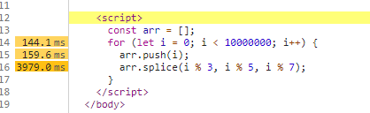

# 浏览器渲染原理

## 1. 浏览器渲染基本过程

现在我们只用一个 img 标签来看一下浏览器在渲染的时候都做了些什么

```html
<!DOCTYPE html>
<html lang="en">
  <head>
    <meta charset="UTF-8" />
    <meta name="viewport" content="width=device-width, initial-scale=1.0" />
    <title>Document</title>
  </head>
  <body>
    
  </body>
</html>
```

现在页面上只有一张图片, 点开控制台, 勾选 network 中 disabled cache(这样我们就能够看到一个完整的浏览器渲染过程) 以及 slow 3G, 然后在 Performance 刷新按钮, 记录浏览器在这个网址内从进入到执行完成都有些什么操作

这里要注意的是, 如果你使用的是 VSCode, 那么在打开 index.html 的时候以本地协议路径打开, 不要以 live Server 的形式打开, 否则你可能会看到许多影响后续操作的东西

点击 performance 面板页的 Event Log, 可以看到浏览器在渲染过程中都记录了哪些日志, 打开以后由于我们目前没有 js 文件, 所以我们需要勾掉如图所示的 scripting, 这一步是将浏览器内置的 js 脚本勾选掉, 那么现在就只剩下 loading--加载中日志, Rendering--渲染中日志, 以及 Painting--绘图中日志


我们首先会看到 send request, 发送时间是 845ms, 也就是在 845ms 之前浏览器在做自己内部的事情, 做完了之后发送了请求, 去请求 index.html 文件, 在右边我们可以看到请求的方式, 请求的文件名, 请求文件的优先级 Priority, 耗时(pending for) 4.9ms, 在左边我们可以看到 Total Time 为 0ms, 那么是否矛盾呢? 但真实情况是实际耗时可能比 4.9ms 更短, 这是因为浏览器也需要反应时间, 最后一个 Initiator 不用管


在 send request 之后接收了响应头, 即 receive response, 以及响应体 receive data, 可以看到接收的文件名, 请求方式, 请求文件的类型, 大小等


然后完成本次加载(Finish loading)

然后开始解析 HTML


在上图中可以看到, parseHTML 的 Total Time 为 7.7ms, 由此可以看到解析是耗费时间的

> 在 parseHTML 里可以看到解析的时候也发送了请求, 点击可以请求的正是我们的图片, 然后 Recalculate Style, 重新计算样式, 包括默认样式, 例如 margin: 8px, 然后 Layout, Update Layer Tree(更新图层树), Paint, 最后 Composite Layers(组合图层), 即到现在为止, 从 Send Request 到 Composite Layers, 浏览器完成了一次渲染

> 由以上几步我们可以看到 Send Request 之后就会 Receive Response, Receive Data 以及 Finish Loading, 然后 parseHTML


> 在上图中, 我们发现有两个 parseHTML, 发现还是 index.html, 虽然上面第一个已经解析, 但是经过了上面的步骤之后又一次解析了, 说明 HTML 的解析不是一次性解析完成的, 而且如下图, 可以看到还有对 JQ 的解析

> 但是像本例中的 index.html 是很小的, 对于他的解析最多也就 2-3 次, 基本不会超过四次, 这里说明不要使用欧朋浏览器去测试, 因为他的次数是固定的, 不管文件大小


但是我们根本没有使用到 js, 更别提 JQ, 这是因为浏览器为了能够将页面显示好, 底层使用到了 JQ, 例如你打开一个 New Page 你就知道为什了会使用到 JQ 了(如果你和我一样使用到了某金插件, 那么你可以先暂时关闭它)

> 但是我们发现到目前为止, 我们的图片还没有请求回来, 我们可以看到在下面又有一个 Receive Response 和两个 Receive Data(说明响应也分了多次, 即浏览器加载资源是异步的), 即图片的响应


我们发现两个 Receive Data 里图片的总大小是 19261 Bytes + 65536 Bytes = 84797 Bytes, 即 82.8095703125 kb, 我们的原图片是 82.81kb


在图片都已经 Receive Data 之后, 我们发现又有 Layout 等, 这说明页面上的样式又重新计算了, 又需要重新布局, 更新图层, 重绘制等

至此浏览器渲染的渲染过程就真正完整了

## 2. style 样式渲染

既然是要看 style 标签内样式的渲染, 那么在原来的文件里, 我们又加上了 1 万多行的 css(这里是 normalize.css 复制了几遍), 然后照常使用本地协议运行


如上图, 发现一开始 receive response 之后有两个 receive data, 并且这两个响应接收的数据都是 65536 Bytes, 然后就开始 ParseHTML 了, 但是我们的 index.html 是 305 kb


> 这表示 index.html 没有完全响应完成, 但是已经开始解析了, 这说明浏览器的响应和 HTML 的解析都是多次的, 且是异步的, 只要接收到响应数据, 就开始解析, 直到接收完成, 然后完成最后的解析, 然后 Finish Loading, 不管是这个 index.html, 还是后面的图片, 都是响应一点, 解析一点

那我们还发现, 在想图片发送请求之后, 就立即解析了 HTML, 并没有等待图片加载完成, 如下图:


> 说明浏览器加载资源是异步的
> 其实浏览器发展至今, 一直都是异步加载资源, 从出生起就是异步加载, 不可能是同步

关键来了, 我们发现在 Event Log 里, 有 parseHTML, 即对应的 HTML 解析器对 HTML 的解析, 那么我们既然在 style 中写了样式, 是不是也应该有一个 parseCSS, 也就是 CSS 解析器来解析我们的样式呢? 但是发现好像没有 parseCSS, 但是页面上样式是生效的, 说明样式一定被解析了, 但是我们又没有发现 parseCSS, 那这个样式是不是由 CSS 解析器解析的呢? 或者说, 样式是被谁解析的呢?

这时候我们发现, 在包含了 style 的那个 index.html 和前面只有图片的 index.html, 两个文件 html 结构是一样的, 就差样式, 而且后者的样式还生效了, 被解析了, 那么我们翻看后者的 Event Log, 我们发现, 在所有的 parseHTML 中, 有一次解析耗费的时间明显要长一点, 甚至那一处的还呈现黄颜色来提醒你, 这里的解析时间明显要长


> 那这就说明 style 标签里的样式被 HTML 解析器解析了(谷歌的开发者文档里有提及), 这里 CSS 解析器并没有对 style 标签里的样式进行解析, 对于 style 标签里的样式给了 HTML 解析器

> 另外 style 标签中的样式是异步解析的, 即 HTML 解析器是异步解析的, 这一点可以从多个 parseHTML 看出
> 异步解析就是解析一点, 渲染一点, 用户看到的画面就是一直在变化的, 即 "闪屏"

## 3. 关于 CSS 阻塞

现在我们将 style 标签中的样式通过外联来加载

可以看到下图中, index.html 的 Finish Loading 是非常快的, 这是因为我们的样式是外联


然后才开始解析, 去发送对 index.css 和 图片的请求, 然后接收到了图片和 index.css 的响应头, 并多次接收响应数据(他俩不是交替的, 谁先加载完一部分就渲染一部分)


然后发现:


> 说明 link 进来的外联样式是 CSS 解析器解析, 而且发现就只有一个 Parse Stylesheet, 说明他是同步解析的

> 而且他是阻塞的, 因为他是 CSS 解析器解析的, CSS 解析器会阻塞页面的渲染, 但是要注意的是, 资源的请求是正常的, 其他的, 比如 HTML, 脚本被阻塞了

> 由于 link 的外联样式会阻塞页面渲染, 所以可以利用它防止 "闪屏"

### 3.1 js 对渲染的影响

现在我们在上一个 index.html 的基础上加上以下 js 代码:

```js
const arr = [];
for (let i = 0; i < 10000000; i++) {
  arr.push(i);
  arr.splice(i % 3, i % 5, i % 7);
}
```

然后我们需要打开 scripting, 其他的 script 不用管, 我们只需要看我们的 js




### 3.2 阻塞渲染结论

#### 3.2.1 关于 CSS 阻塞(原因: CSS 解析器在解析外联样式的时候是同步解析的)

> 声明: 只有 link 引入的外部 css 才能够产生阻塞

- style 标签中的样式

  - 由 html 解析器进行解析
  - 不阻塞浏览器渲染(可能会产生"闪屏": 由于现在的浏览器十分的迎合用户, 对于有些浏览器产商来说, 他可能会做到)
  - 不阻塞 DOM 解析: HTML 解析器是异步解析的, 一个任务在解析样式, 但是不耽误另外一个 HTML 解析器往下读取 HTML 结构

- link 引入的外部 css 样式(推荐使用的方式)
  - 由 CSS 解析器进行解析
  - 阻塞浏览器渲染(可以利用这种阻塞避免 "闪屏")(要么不干活, 要么干完了)
  - 阻塞其后面的 js 语句的执行(与其说是 link 阻塞了后续 js 的执行, 不如说是后面的 js 会等待 link 引入的 css 文件的下载)
    - 原因: 如果后面的 js 的内容是获取元素的样式, 例如宽高等 CSS 控制的属性, 如果不等样式解析完成, 后面的 js 就获得了错误的信息, 由于浏览器也不知道后续 js 的具体内容, 所以只好等前面所有的样式都解析完成, 再执行 js, 例如 Firefox 在样式表加载和解析的过程中, 会禁止掉所有的脚本
    - 注意: 现在浏览器越发注重用户体验, 对于 webkit 内核的浏览器而言, 仅当脚本尝试访问的样式属性, 或可能受尚未加载的样式表影响时他才会禁止该脚本(这是单开了一个进程, HTML 解析器照常解析, 该进程如果发现后续的文档里没有任何对 CSS 的操作, 那就一直执行, 如果有, 禁止脚本)
  - 不阻塞 DOM 的解析
    - 原因: DOM 解析和 CSS 解析是两个并行的进程, 浏览器解析 DOM 生成 DOM Tree, 解析 CSS 生成 CSS Tree, 最终组成 Render Tree, 再渲染页面, 即: DOM 的解析, CSS 的解析是并行执行的, 即: 不阻塞 DOM 解析

#### 3.2.2 优化核心概念, 尽可能快的提高外部 CSS 加载速度

虽然 link 不闪屏, 但是如果 css 一万行, 那也太慢了, 所以有优化它的方法如下:

- 使用 CDN 节点进行外部资源加速
- 对 CSS 进行压缩(利用打包工具, 例如 webpack, gulp 等)
- 减少 http 的请求次数, 将多个 css 文件合并
- 优化样式表的代码

## 4. js 阻塞

- 阻塞 DOM 的解析:
  - 原因: 浏览器不知道后续脚本的内容, 如果先去解析了下面的 DOM, 而后的 js 删除了后面的所有 DOM, 那么浏览器就做了无用功, 浏览器无法预估脚本里面具体做了什么操作, 例如 document.write 这种操作, 索性全部停住, 等脚本执行完了, 浏览器再去向下解析 DOM
- 阻塞页面的渲染: js 中也可以给 DOM 设置样式, 浏览器同样等该脚本执行完毕, 再继续干活, 避免做无用功(当然, 现代的浏览器很聪明, 他会开启一个进程, 如果发现之后的 DOM 有 link, script, img 标签等, 他会帮助我们先行下载里面的资源, 不会等到解析到那里时才开始下载)
- 阻塞后续 js 的执行: 维护依赖关系, 例如: 必须先引入 jQuery, 再引入 bootstrap

### 4.1 script 标签

[【知识点】你知道 CSS 与 JS 是否会阻塞 DOM 解析和渲染吗？](https://www.bilibili.com/read/cv7142810/)

> 浏览器遇到 script 标签时, 会触发冲渲染

这个细节可能大多数人都并不清楚, 其实这才是解释上面为何 JS 执行会等待 CSS 下载的原因

先上例子, HTML 内 body 的结构如下:

```html
<div></div>
<script src="../js/sleep-3000-logDiv.js"></script>
<style>
  div {
    background: lightcoral;
  }
</style>
<script src="../js/sleep-5000-logDiv.js"></script>
<link rel="stylesheet" href="../css/common.css" />
```

这个例子也是很极端的例子, 但不妨碍它透露给我们很多重要的信息。想象一下, 页面会怎样呢? 答案是先浅绿色, 再浅灰色, 最后浅蓝色。由此可见, 每次碰到 script 标签时, 浏览器都会渲染一次页面。这是基于同样的理由, 浏览器不知道脚本的内容, 因而碰到脚本时, 只好先渲染页面, 确保脚本能获取到最新的 DOM 元素信息, 尽管脚本可能不需要这些信息。

### 4.2 script 标签到底该放在哪里

一般 script 标签会被放在头部或尾部。头部就是`<head>`里面, 尾部一般指`<body>`里。

将 script 放在`<head>`里, 浏览器解析 HTML, 发现 script 标签时, 会先下载完所有这些 script, 再往下解析其他的 HTML。讨厌的是浏览器在下载 JS 时, 是不能多个 JS 并发一起下载的。不管 JS 是不来来自同一个 host, 浏览器最多只能同时下载两个 JS, 且浏览器下载 JS 时, 就 block 掉解析其他 HTML 的工作。将 script 放在头部, 会让网页内容呈现滞后, 导致用户感觉到卡。所以 yahoo 建议将 script 放在尾部, 这样能加速网页加载。

将 script 放在尾部的缺点, 是浏览器只能先解析完整个 HTML 页面, 再下载 JS。而对于一些高度依赖于 JS 的网页, 就会显得慢了。所以将 script 放在尾部也不是最优解, 最优解是一边解析页面, 一边下载 JS。

所以提出了一种更 modern 的方式: 使用 async 和 defer。80%的现代浏览器都认识 async 和 defer 属性, 这两个属性能让浏览器做到一边下载 JS(还是只能同时下载两个 JS), 一边解析 HTML。他的优点不是增加 JS 的并发下载数量, 而是做到下载时不 block 解析 HTML。

```js
<script type="text/javascript" src="path/to/script1.js" async></script>
<script type="text/javascript" src="path/to/script2.js" async></script>
```

结论

如果可以不考虑支持 `<IE9` 的 IE, 最好的做法是将 script 标签放在 head 中, 并使用 async/defer 属性。这样浏览器就能一边下载 JS, 一边解析其他的 HTML。

Google 自己的代码 script 放的也有点乱, 有的放在`</body>`后面, 有的放在`<body>`里面, 还有的放在`<head>`里面。总体来说, 放在`<body>`里其实是最常见的做法。

本文只讨论 script 的位置, 至于 link 和 style, 还是放在 head 里的做法比较常见。link 也是要下载 CSS 的啊, 为毛不考虑下载 CSS 阻塞 HTML 解析的问题呢? 其实, 一般情况下, JS 和 CSS, 放在 head 和放在 body 区别不大。CSS 的 link 放在 body 也是可以的, 只是可能导致页面暂时没有样式

脚本引起的问题是它们阻止并行下载。HTTP / 1.1 规范建议浏览器每个主机名并行下载最多两个组件。如果从多个主机名提供映像, 则可以并行进行两个以上的下载。但是, 在下载脚本时, 即使使用不同的主机名, 浏览器也不会启动任何其他下载

异步脚本具有以下优点:

- 并行下载资源:
  浏览器可以并行下载样式表, 图像和其他脚本, 而无需等待脚本下载和执行。
- 源顺序独立性:
  您可以将脚本放置在头部或正文中, 而无需担心阻塞(如果使用 CMS 则很有用)。执行顺序仍然很重要。

### 4.3 现代方法

```html
<script type="module" src="..."></script>
```

默认情况下, 模块是异步加载和延迟的。也就是说, 您可以将它们放置在任何地方, 它们将并行加载, 并在页面加载完成后执行

网页中插入一个模块 foo.js, 由于 type 属性设为 module, 所以浏览器知道这是一个 ES6 模块。
浏览器对于带有 `type="module"` 的`<script>`, 都是异步加载, 不会造成堵塞浏览器, 即等到整个页面渲染完, 再执行模块脚本, 等同于打开了`<script>`标签的 defer 属性。

## 5. 备注

1. css 的解析和 js 的执行时互斥的, css 解析的时候 js 停止执行, js 执行的时候 css 停止解析
2. 无论 css 阻塞, 还是 js 阻塞, 都不会阻塞浏览器加载外部资源(图片, 样式, 视频, 脚本等): 浏览器始终处于一种"先把请求发出去的工作模式", 只要涉及到网络请求的内容, 无论是图片, 样式, 脚本, 都会先发送请求去获取资源, 至于资源到本地之后什么时候使用, 由浏览器自己协调, 这种做法效率很高(这应该是依赖于网络进程)
3. Webkit 和 Firefox 都进行了"预解析"这项优化, 在执行 js 脚本时, 浏览器的其他线程会解析文档其余部分, 找出并加载需要通过网络加载的其他资源, 通过这种方式, 资源可以在并行连接上加载, 从而提高总体速度, 请注意: 预解析不会修改 DOM 树

在上述过程中, 网页在加载和渲染过程中会触发 DOMContentloaded 和 onload 事件, 分别是在 DOM 树构建(解析)完成之后, 以及 DOM 树构建完毕并且网页所依赖的资源都加载完之后

上面介绍的是一个完整的渲染过程, 但现代网页很多都是动态的, 这意味着在渲染完成之后, 由于网页的动画或者用户的交互, 浏览器其实一直在不停地重复执行渲染过程。(重绘重排), 以上的数字表示的是基本顺序, 这不是严格一致的, 这个过程可能重复也可能交叉
